# Portfolio Optimization with Multivariate GARCH Model Comparison

``` r
library(tsbs)
library(quantmod)
library(ggplot2)
library(gridExtra)
library(knitr)
```

``` r
## =============================================================================
## GLOBAL SETTINGS - Adjust these to control computation time and data source
## =============================================================================

## Set to TRUE for full analysis, FALSE for quick demo
FULL_ANALYSIS <- FALSE

## Data source: "package" uses pre-downloaded data from tsbs package
##              "download" fetches fresh data from Yahoo Finance
DATA_SOURCE <- "package"  ## Options: "package" or "download"

if (FULL_ANALYSIS) {
  max_num_rb <- 10      ## Number of rebalances with bootstrap
  max_iter <- 20        ## Maximum EM iterations per model
  num_boots <- 100         ## Bootstrap replicates per rebalance
  train_window <- 504   ## ~2 years training
} else {
  max_num_rb <- 3       ## Quick demo: 3 rebalances
  max_iter <- 3         ## Quick demo: 3 iterations
  num_boots <- 30          ## Quick demo: 30 replicates
  train_window <- 252   ## Quick demo: 1 year training
}

collect_diagnostics <- TRUE
verbose <- FALSE
return_fit <- TRUE
```

## Introduction

This vignette demonstrates advanced portfolio optimization using the
**tsbs** package’s Markov-Switching VARMA-GARCH bootstrap framework. We
compare three multivariate GARCH correlation structures:

1.  **DCC (Dynamic Conditional Correlation)**: The workhorse model with
    explicit correlation dynamics
2.  **CGARCH (Copula GARCH)**: Separates marginals from dependence via
    copula theory
3.  **GOGARCH (Generalized Orthogonal GARCH)**: Uses ICA to extract
    independent factors

Each model captures time-varying correlations differently, leading to
potentially different portfolio allocations and uncertainty
quantification.

### Key Features Demonstrated

- Six portfolio optimization strategies with real market data
- Out-of-sample backtesting with quarterly rebalancing
- **Bootstrap uncertainty quantification** comparing all three GARCH
  models
- **Bootstrap diagnostics** using the `tsbs_diagnostics` system
- Comprehensive performance analysis with transaction costs

### What is a Bootstrapped Series?

Before diving into portfolio optimization, let’s visualize what the
MS-VARMA-GARCH bootstrap actually produces. The basic idea is:

1.  Take raw price data and compute log-returns
2.  Fit a Markov-Switching model that identifies different market
    regimes (e.g., calm vs. volatile periods)
3.  Generate new return series by resampling blocks of returns while
    respecting the regime structure
4.  Convert the bootstrapped returns back to a synthetic price series

The plot below shows an original SPY price series alongside a
bootstrapped version. The colored bands indicate the estimated market
regimes—notice how the bootstrap preserves the general character of each
regime while creating a genuinely new path.

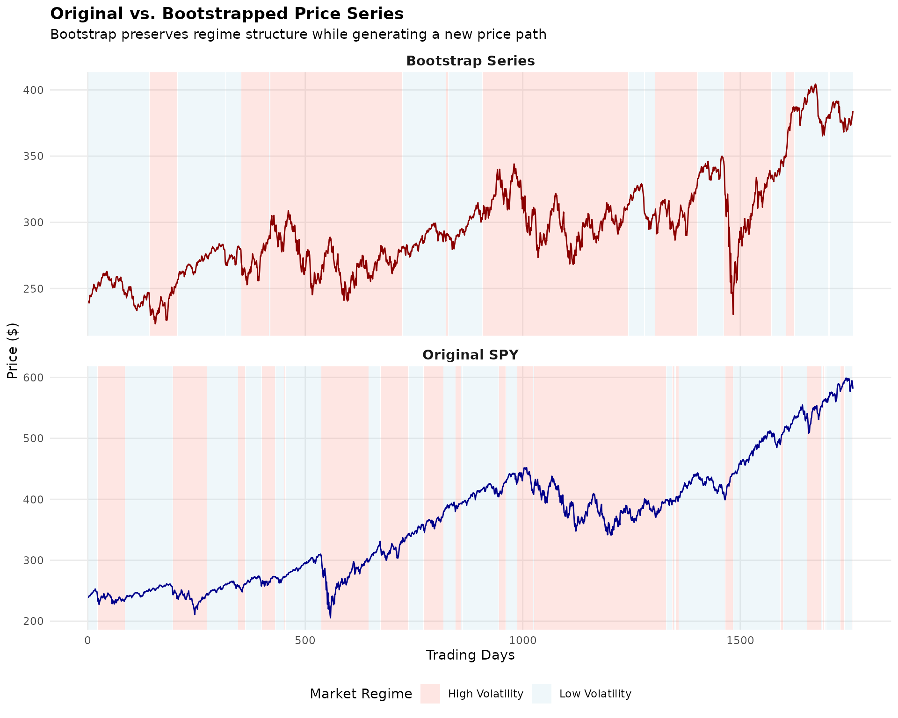

The bootstrap series (bottom panel) is not a forecast—it’s a *plausible
alternative history* that could have occurred given the same underlying
market dynamics. By generating many such series and computing portfolio
weights on each, we can quantify how uncertain our optimal allocation
really is.

## Part 1: Portfolio Optimization Functions

``` r
## =============================================================================
## PORTFOLIO OPTIMIZATION FUNCTIONS
## =============================================================================

## 1.1 Minimum Variance Portfolio
min_variance_portfolio <- function(returns, ...) {
  Sigma <- cov(returns)
  n <- ncol(returns)
  
  if (requireNamespace("quadprog", quietly = TRUE)) {
    Dmat <- 2 * Sigma + diag(1e-8, n)
    dvec <- rep(0, n)
    Amat <- cbind(rep(1, n), diag(n))
    bvec <- c(1, rep(0, n))
    sol <- tryCatch(
      quadprog::solve.QP(Dmat, dvec, Amat, bvec, meq = 1),
      error = function(e) NULL
    )
    if (!is.null(sol)) {
      weights <- pmax(sol$solution, 0)
      weights <- weights / sum(weights)
    } else {
      weights <- rep(1/n, n)
    }
  } else {
    ones <- rep(1, n)
    Sigma_inv <- tryCatch(solve(Sigma + diag(1e-6, n)), 
                          error = function(e) diag(1/diag(Sigma)))
    weights <- as.vector(Sigma_inv %*% ones) / as.vector(t(ones) %*% Sigma_inv %*% ones)
    weights <- pmax(weights, 0)
    weights <- weights / sum(weights)
  }
  names(weights) <- colnames(returns)
  weights
}

## 1.2 Maximum Sharpe Ratio Portfolio
max_sharpe_portfolio <- function(returns, rf = 0, ...) {
  mu <- colMeans(returns)
  Sigma <- cov(returns)
  n <- ncol(returns)
  mu_excess <- mu - rf
  
  if (all(mu_excess <= 0)) {
    return(min_variance_portfolio(returns))
  }
  
  if (requireNamespace("quadprog", quietly = TRUE)) {
    Dmat <- 2 * Sigma + diag(1e-8, n)
    dvec <- rep(0, n)
    Amat <- cbind(mu_excess, diag(n))
    bvec <- c(1, rep(0, n))
    sol <- tryCatch(
      quadprog::solve.QP(Dmat, dvec, Amat, bvec, meq = 1),
      error = function(e) NULL
    )
    if (!is.null(sol) && sum(sol$solution) > 0) {
      weights <- pmax(sol$solution, 0)
      weights <- weights / sum(weights)
    } else {
      weights <- min_variance_portfolio(returns)
    }
  } else {
    weights <- min_variance_portfolio(returns)
  }
  names(weights) <- colnames(returns)
  weights
}

## 1.3 Risk Parity Portfolio
risk_parity_portfolio <- function(returns, ...) {
  Sigma <- cov(returns)
  n <- ncol(returns)
  
  vols <- sqrt(diag(Sigma))
  if (any(!is.finite(vols)) || any(vols < 1e-10)) {
    weights <- rep(1/n, n)
    names(weights) <- colnames(returns)
    return(weights)
  }
  
  weights <- 1 / vols
  weights <- weights / sum(weights)
  
  for (iter in 1:20) {
    port_vol <- sqrt(t(weights) %*% Sigma %*% weights)
    if (!is.finite(port_vol) || port_vol < 1e-10) break
    
    mrc <- (Sigma %*% weights) / as.numeric(port_vol)
    rc <- weights * mrc
    target_rc <- sum(rc) / n
    adjustment <- target_rc / (rc + 1e-8)
    weights <- weights * sqrt(pmax(adjustment, 0))
    
    if (sum(weights) < 1e-10 || any(!is.finite(weights))) {
      weights <- rep(1/n, n)
      break
    }
    weights <- weights / sum(weights)
  }
  
  names(weights) <- colnames(returns)
  weights
}

## 1.4 Black-Litterman Portfolio
black_litterman_portfolio <- function(returns, risk_aversion = 2.5, tau = 0.05, ...) {
  mu_hist <- colMeans(returns)
  Sigma <- cov(returns)
  n <- ncol(returns)
  
  w_mkt <- rep(1/n, n)
  pi <- risk_aversion * Sigma %*% w_mkt
  
  P <- diag(n)
  Q <- mu_hist
  omega_diag <- diag(Sigma) * tau
  Omega <- diag(omega_diag)
  
  tau_Sigma <- tau * Sigma
  tau_Sigma_inv <- solve(tau_Sigma + diag(1e-8, n))
  Omega_inv <- solve(Omega + diag(1e-8, n))
  
  M_inv <- tau_Sigma_inv + t(P) %*% Omega_inv %*% P
  M <- solve(M_inv + diag(1e-8, n))
  mu_bl <- M %*% (tau_Sigma_inv %*% pi + t(P) %*% Omega_inv %*% Q)
  
  if (requireNamespace("quadprog", quietly = TRUE)) {
    Sigma_bl <- Sigma + tau_Sigma
    Dmat <- 2 * risk_aversion * Sigma_bl + diag(1e-8, n)
    dvec <- as.vector(mu_bl)
    Amat <- cbind(rep(1, n), diag(n))
    bvec <- c(1, rep(0, n))
    sol <- tryCatch(
      quadprog::solve.QP(Dmat, dvec, Amat, bvec, meq = 1),
      error = function(e) NULL
    )
    if (!is.null(sol)) {
      weights <- pmax(sol$solution, 0)
      weights <- weights / sum(weights)
    } else {
      weights <- rep(1/n, n)
    }
  } else {
    weights <- rep(1/n, n)
  }
  names(weights) <- colnames(returns)
  weights
}

## 1.5 Mean-Variance with Shrinkage (Ledoit-Wolf)
shrinkage_portfolio <- function(returns, target_return = NULL, ...) {
  mu <- colMeans(returns)
  n <- ncol(returns)
  T_obs <- nrow(returns)
  
  S <- cov(returns)
  trace_S <- sum(diag(S))
  F_target <- (trace_S / n) * diag(n)
  
  X <- scale(returns, center = TRUE, scale = FALSE)
  sum_sq <- sum(S^2)
  delta <- min(1, max(0, (1/T_obs) / (sum_sq / n + 1e-8)))
  Sigma_shrunk <- delta * F_target + (1 - delta) * S
  
  if (requireNamespace("quadprog", quietly = TRUE)) {
    Dmat <- 2 * Sigma_shrunk + diag(1e-8, n)
    dvec <- rep(0, n)
    Amat <- cbind(rep(1, n), diag(n))
    bvec <- c(1, rep(0, n))
    sol <- tryCatch(
      quadprog::solve.QP(Dmat, dvec, Amat, bvec, meq = 1),
      error = function(e) NULL
    )
    if (!is.null(sol)) {
      weights <- pmax(sol$solution, 0)
      weights <- weights / sum(weights)
    } else {
      weights <- rep(1/n, n)
    }
  } else {
    weights <- rep(1/n, n)
  }
  names(weights) <- colnames(returns)
  weights
}

## 1.6 Equal Weight (Benchmark)
equal_weight_portfolio <- function(returns, ...) {
  n <- ncol(returns)
  weights <- rep(1/n, n)
  names(weights) <- colnames(returns)
  weights
}

## Portfolio performance metrics
calc_portfolio_metrics <- function(returns, weights) {
  port_ret <- as.vector(returns %*% weights)
  ann_factor <- 252
  
  mean_ret <- mean(port_ret) * ann_factor
  vol <- sd(port_ret) * sqrt(ann_factor)
  sharpe <- mean_ret / vol
  
  cum_ret <- cumprod(1 + port_ret)
  rolling_max <- cummax(cum_ret)
  drawdown <- (cum_ret - rolling_max) / rolling_max
  max_dd <- min(drawdown)
  
  downside_ret <- port_ret[port_ret < 0]
  downside_dev <- if (length(downside_ret) > 1) sd(downside_ret) * sqrt(ann_factor) else vol
  sortino <- mean_ret / downside_dev
  
  c(
    "Ann.Return" = mean_ret * 100,
    "Ann.Vol" = vol * 100,
    "Sharpe" = sharpe,
    "Sortino" = sortino,
    "MaxDD" = max_dd * 100
  )
}
```

## Part 2: Data Download and Preparation

    ## =======================================================================

    ## ADVANCED PORTFOLIO OPTIMIZATION WITH MULTIVARIATE GARCH COMPARISON

    ## =======================================================================

``` r
## Asset information
symbols <- c("SPY", "EFA", "BND", "GLD", "VNQ")
symbol_names <- c("US Equity", "Intl Equity", "US Bonds", "Gold", "REITs")

if (DATA_SOURCE == "package") {
  ## -------------------------------------------------------------------------
  ## Option 1: Use pre-downloaded data from tsbs package
  ## -------------------------------------------------------------------------
  data("etf_returns", package = "tsbs")
  
  y_full <- etf_returns
  dates_full <- attr(etf_returns, "dates")
  symbols <- attr(etf_returns, "symbols")
  symbol_names <- attr(etf_returns, "symbol_names")
  
  cat("\nUsing package data (etf_returns)\n")
  cat("  Source:", attr(etf_returns, "source"), "\n")
  cat("  Downloaded:", as.character(attr(etf_returns, "download_date")), "\n")
  
} else {
  ## -------------------------------------------------------------------------
  ## Option 2: Download fresh data from Yahoo Finance
  ## -------------------------------------------------------------------------
  start_date <- "2018-01-01"
  end_date <- Sys.Date()
  
  cat("\nDownloading fresh data from Yahoo Finance...\n")
  cat("  Symbols:", paste(symbols, collapse = ", "), "\n")
  cat("  Date range:", start_date, "to", as.character(end_date), "\n")
  
  prices_list <- lapply(symbols, function(sym) {
    tryCatch({
      getSymbols(sym, src = "yahoo", from = start_date, to = end_date, 
                 auto.assign = FALSE)
    }, error = function(e) {
      warning(paste("Failed to download", sym))
      NULL
    })
  })
  
  valid_idx <- !sapply(prices_list, is.null)
  if (sum(valid_idx) < 3) {
    stop("Could not download enough symbols. Check internet connection.")
  }
  
  symbols <- symbols[valid_idx]
  symbol_names <- symbol_names[valid_idx]
  prices_list <- prices_list[valid_idx]
  
  adj_close <- do.call(merge, lapply(prices_list, Ad))
  colnames(adj_close) <- symbols
  adj_close <- na.omit(adj_close)
  
  returns_xts <- diff(log(adj_close)) * 100
  returns_xts <- na.omit(returns_xts)
  
  y_full <- as.matrix(coredata(returns_xts))
  dates_full <- index(returns_xts)
}
```

    ## 
    ## Using package data (etf_returns)
    ##   Source: Yahoo Finance via quantmod 
    ##   Downloaded: 2026-01-21

``` r
k <- ncol(y_full)
```

    ## 
    ## Data summary:

    ##   Period: 2018-01-03 to 2024-12-30

    ##   Observations: 1759

    ##   Assets: SPY, EFA, BND, GLD, VNQ

    ## -----------------------------------------------------------------------

    ## IN-SAMPLE STATISTICS

    ## -----------------------------------------------------------------------

    ## 
    ## Annualized statistics:

``` r
ann_stats <- rbind(
  "Return (%)" = colMeans(y_full) * 252,
  "Vol (%)" = apply(y_full, 2, sd) * sqrt(252),
  "Sharpe" = colMeans(y_full) / apply(y_full, 2, sd) * sqrt(252)
)
print(round(ann_stats, 2))
```

    ##              SPY   EFA  BND   GLD   VNQ
    ## Return (%) 12.84  3.90 1.06  9.37  4.79
    ## Vol (%)    19.54 18.27 6.16 14.33 23.12
    ## Sharpe      0.66  0.21 0.17  0.65  0.21

    ## 
    ## Correlation matrix:

``` r
print(round(cor(y_full), 2))
```

    ##      SPY  EFA  BND  GLD  VNQ
    ## SPY 1.00 0.87 0.16 0.11 0.76
    ## EFA 0.87 1.00 0.20 0.21 0.71
    ## BND 0.16 0.20 1.00 0.36 0.29
    ## GLD 0.11 0.21 0.36 1.00 0.16
    ## VNQ 0.76 0.71 0.29 0.16 1.00

## Part 3: Model Specifications

We define specifications for three multivariate GARCH model types:

- **DCC**: Uses `dcc_modelspec` with correlation dynamics (α, β)
- **CGARCH**: Uses `cgarch_modelspec` with copula-based dependence
- **GOGARCH**: Uses `gogarch_modelspec` with ICA decomposition

``` r
## =============================================================================
## MODEL SPECIFICATIONS FOR DCC, CGARCH, AND GOGARCH
## =============================================================================

## --- DCC Specification ---
make_dcc_spec <- function(omega, alpha, beta, dcc_alpha, dcc_beta, k) {
  list(
    var_order = 1,
    garch_spec_fun = "dcc_modelspec",
    distribution = "mvn",
    garch_spec_args = list(
      dcc_order = c(1, 1),
      dynamics = "dcc",
      garch_model = list(
        univariate = lapply(1:k, function(i) {
          list(model = "garch", garch_order = c(1, 1), distribution = "norm")
        })
      )
    ),
    start_pars = list(
      var_pars = rep(0, k * (1 + k)),
      garch_pars = lapply(1:k, function(i) {
        list(omega = omega[i], alpha1 = alpha[i], beta1 = beta[i])
      }),
      dcc_pars = list(alpha_1 = dcc_alpha, beta_1 = dcc_beta),
      dist_pars = NULL
    )
  )
}

spec_dcc <- list(
  make_dcc_spec(
    omega = rep(0.02, k), alpha = rep(0.05, k), beta = rep(0.90, k),
    dcc_alpha = 0.02, dcc_beta = 0.95, k = k
  ),
  make_dcc_spec(
    omega = rep(0.08, k), alpha = rep(0.12, k), beta = rep(0.80, k),
    dcc_alpha = 0.06, dcc_beta = 0.90, k = k
  )
)

## --- CGARCH Specification ---
make_cgarch_spec <- function(omega, alpha, beta, dcc_alpha, dcc_beta, k, 
                              copula = "mvn", transformation = "parametric") {
  list(
    var_order = 1,
    garch_spec_fun = "cgarch_modelspec",
    distribution = copula,
    garch_spec_args = list(
      dcc_order = c(1, 1),
      dynamics = "dcc",
      transformation = transformation,
      copula = copula,
      garch_model = list(
        univariate = lapply(1:k, function(i) {
          list(model = "garch", garch_order = c(1, 1), distribution = "norm")
        })
      )
    ),
    start_pars = list(
      var_pars = rep(0, k * (1 + k)),
      garch_pars = lapply(1:k, function(i) {
        list(omega = omega[i], alpha1 = alpha[i], beta1 = beta[i])
      }),
      dcc_pars = list(alpha_1 = dcc_alpha, beta_1 = dcc_beta),
      dist_pars = list(shape = 6)  ## For MVT copula
    )
  )
}

# spec_cgarch <- list(
#   make_cgarch_spec(
#     omega = rep(0.02, k), alpha = rep(0.05, k), beta = rep(0.90, k),
#     dcc_alpha = 0.02, dcc_beta = 0.95, k = k, 
#     copula = "mvn", transformation = "parametric"
#   ),
#   make_cgarch_spec(
#     omega = rep(0.08, k), alpha = rep(0.12, k), beta = rep(0.80, k),
#     dcc_alpha = 0.06, dcc_beta = 0.90, k = k,
#     copula = "mvn", transformation = "parametric"
#   )
# )

spec_cgarch <- list(
  make_cgarch_spec(
    omega = rep(0.02, k), alpha = rep(0.05, k), beta = rep(0.90, k),
    dcc_alpha = 0.02, dcc_beta = 0.95, k = k, 
    copula = "mvt", transformation = "parametric"
  ),
  make_cgarch_spec(
    omega = rep(0.08, k), alpha = rep(0.12, k), beta = rep(0.80, k),
    dcc_alpha = 0.06, dcc_beta = 0.90, k = k,
    copula = "mvt", transformation = "parametric"
  )
)

## --- GOGARCH Specification ---
make_gogarch_spec <- function(omega, alpha, beta, k) {
  list(
    var_order = 1,
    garch_spec_fun = "gogarch_modelspec",
    distribution = "norm",
    garch_spec_args = list(
      model = "garch",
      order = c(1, 1),
      ica = "radical",
      components = k
    ),
    start_pars = list(
      var_pars = rep(0, k * (1 + k)),
      garch_pars = lapply(1:k, function(i) {
        list(omega = omega[i], alpha1 = alpha[i], beta1 = beta[i])
      }),
      dist_pars = NULL
    )
  )
}

spec_gogarch <- list(
  make_gogarch_spec(
    omega = rep(0.02, k), alpha = rep(0.05, k), beta = rep(0.90, k), k = k
  ),
  make_gogarch_spec(
    omega = rep(0.08, k), alpha = rep(0.12, k), beta = rep(0.80, k), k = k
  )
)
```

    ## 
    ## Model specifications created:

    ##   - DCC: 2 regime states with DCC(1,1) dynamics

    ##   - CGARCH: 2 regime states with MVN copula

    ##   - GOGARCH: 2 regime states with RADICAL ICA

## Part 4: Backtest Setup

    ## =======================================================================

    ## OUT-OF-SAMPLE BACKTEST

    ## =======================================================================

``` r
## Parameters
rebalance_freq <- 63  ## Quarterly rebalancing

n_total <- nrow(y_full)
rebalance_dates <- seq(train_window + 1, n_total - rebalance_freq, by = rebalance_freq)
```

    ## 
    ## Backtest setup:

    ##   Training window: 252 days

    ##   Rebalance frequency: 63 days (~quarterly)

    ##   Number of rebalances: 23

    ##   Bootstrap replicates per rebalance: 30

    ##   Max rebalances with bootstrap: 3

``` r
## Strategies to test
strategies <- list(
  "Equal Weight" = equal_weight_portfolio,
  "Min Variance" = min_variance_portfolio,
  "Max Sharpe" = max_sharpe_portfolio,
  "Risk Parity" = risk_parity_portfolio,
  "Black-Litterman" = black_litterman_portfolio,
  "Shrinkage" = shrinkage_portfolio
)

## Storage for results
backtest_returns <- matrix(NA, nrow = n_total - train_window, ncol = length(strategies))
colnames(backtest_returns) <- names(strategies)

weight_history <- lapply(strategies, function(x) {
  matrix(NA, nrow = length(rebalance_dates), ncol = k)
})
```

## Part 5: Multi-Model Bootstrap Backtest

This is the core of our analysis. For each rebalance period, we run
bootstrap using all three GARCH model types and compare their
uncertainty estimates.

``` r
## =============================================================================
## RUN BACKTEST WITH DCC, CGARCH, AND GOGARCH COMPARISON
## =============================================================================

cat("\nRunning backtest with multi-model bootstrap comparison...\n")

set.seed(42)
current_weights <- lapply(strategies, function(x) rep(1/k, k))

pb <- txtProgressBar(min = 0, max = length(rebalance_dates), style = 3)

## Storage for bootstrap results from each model type
boot_results_dcc <- list()
boot_results_cgarch <- list()
boot_results_gogarch <- list()

## Storage for diagnostics from each model
diagnostics_dcc <- list()
diagnostics_cgarch <- list()
diagnostics_gogarch <- list()

for (rb_idx in seq_along(rebalance_dates)) {
  rb_date <- rebalance_dates[rb_idx]
  
  ## Training data
  train_start <- rb_date - train_window
  train_end <- rb_date - 1
  y_train <- y_full[train_start:train_end, ]
  
  ## Compute new weights for each strategy
  for (strat_name in names(strategies)) {
    strat_func <- strategies[[strat_name]]
    
    tryCatch({
      new_weights <- strat_func(y_train)
      current_weights[[strat_name]] <- new_weights
      weight_history[[strat_name]][rb_idx, ] <- new_weights
    }, error = function(e) {
      ## Keep previous weights on error
    })
  }
  
  ## Run multi-model bootstrap for first max_num_rb rebalances
  if (rb_idx <= max_num_rb) {
    
    ## --- DCC Bootstrap ---
    result_dcc <- tryCatch({
      boot_result <- tsbs(
        x = y_train,
        bs_type = "ms_varma_garch",
        num_boots = num_boots,
        num_blocks = 15,
        num_states = 2,
        spec = spec_dcc,
        model_type = "multivariate",
        func = risk_parity_portfolio,
        apply_func_to = "all",
        control = list(max_iter = max_iter, tol = 1e-2),
        parallel = TRUE,
        num_cores = 4,
        return_fit = return_fit,
        collect_diagnostics = collect_diagnostics
      )
      list(
        weights = do.call(rbind, lapply(boot_result$func_outs, function(w) t(w))),
        diagnostics = if(collect_diagnostics && return_fit) boot_result$fit$diagnostics else NULL
      )
    }, error = function(e) {
      message("DCC bootstrap failed at rebalance ", rb_idx, ": ", e$message)
      NULL
    })
    
    if (!is.null(result_dcc)) {
      boot_results_dcc[[rb_idx]] <- result_dcc$weights
      diagnostics_dcc[[rb_idx]] <- result_dcc$diagnostics
    }
    
    ## --- CGARCH Bootstrap ---
    result_cgarch <- tryCatch({
      boot_result <- tsbs(
        x = y_train,
        bs_type = "ms_varma_garch",
        num_boots = num_boots,
        num_blocks = 15,
        num_states = 2,
        spec = spec_cgarch,
        model_type = "multivariate",
        func = risk_parity_portfolio,
        apply_func_to = "all",
        control = list(max_iter = max_iter, tol = 1e-2),
        parallel = TRUE,
        num_cores = 4,
        return_fit = return_fit,
        collect_diagnostics = collect_diagnostics
      )
      list(
        weights = do.call(rbind, lapply(boot_result$func_outs, function(w) t(w))),
        diagnostics = if(collect_diagnostics && return_fit) boot_result$fit$diagnostics else NULL
      )
    }, error = function(e) {
      message("CGARCH bootstrap failed at rebalance ", rb_idx, ": ", e$message)
      NULL
    })
    
    if (!is.null(result_cgarch)) {
      boot_results_cgarch[[rb_idx]] <- result_cgarch$weights
      diagnostics_cgarch[[rb_idx]] <- result_cgarch$diagnostics
    }
    
    ## --- GOGARCH Bootstrap ---
    result_gogarch <- tryCatch({
      boot_result <- tsbs(
        x = y_train,
        bs_type = "ms_varma_garch",
        num_boots = num_boots,
        num_blocks = 15,
        num_states = 2,
        spec = spec_gogarch,
        model_type = "multivariate",
        func = risk_parity_portfolio,
        apply_func_to = "all",
        control = list(max_iter = max_iter, tol = 1e-2),
        parallel = TRUE,
        num_cores = 4,
        return_fit = return_fit,
        collect_diagnostics = collect_diagnostics
      )
      list(
        weights = do.call(rbind, lapply(boot_result$func_outs, function(w) t(w))),
        diagnostics = if(collect_diagnostics && return_fit) boot_result$fit$diagnostics else NULL
      )
    }, error = function(e) {
      message("GOGARCH bootstrap failed at rebalance ", rb_idx, ": ", e$message)
      NULL
    })
    
    if (!is.null(result_gogarch)) {
      boot_results_gogarch[[rb_idx]] <- result_gogarch$weights
      diagnostics_gogarch[[rb_idx]] <- result_gogarch$diagnostics
    }
  }
  
  ## Calculate returns until next rebalance
  if (rb_idx < length(rebalance_dates)) {
    next_rb <- rebalance_dates[rb_idx + 1]
  } else {
    next_rb <- n_total
  }
  
  hold_period <- rb_date:(next_rb - 1)
  hold_returns <- y_full[hold_period, , drop = FALSE]
  
  for (strat_name in names(strategies)) {
    w <- current_weights[[strat_name]]
    port_ret <- hold_returns %*% w
    result_idx <- hold_period - train_window
    backtest_returns[result_idx, strat_name] <- port_ret
  }
  
  setTxtProgressBar(pb, rb_idx)
}
close(pb)

cat("\nBacktest completed!\n")
```

## Part 6: Backtest Results

    ## -----------------------------------------------------------------------

    ## BACKTEST RESULTS

    ## -----------------------------------------------------------------------

``` r
## Remove NA rows
backtest_returns <- backtest_returns[complete.cases(backtest_returns), ]

## Calculate performance metrics
perf_summary <- t(sapply(colnames(backtest_returns), function(strat) {
  ret <- backtest_returns[, strat]
  
  ann_ret <- mean(ret) * 252
  ann_vol <- sd(ret) * sqrt(252)
  sharpe <- ann_ret / ann_vol
  
  cum_ret <- cumprod(1 + ret/100)
  rolling_max <- cummax(cum_ret)
  max_dd <- min((cum_ret - rolling_max) / rolling_max)
  
  c(
    "Ann.Return(%)" = ann_ret,
    "Ann.Vol(%)" = ann_vol,
    "Sharpe" = sharpe,
    "MaxDD(%)" = max_dd * 100
  )
}))
```

    ## 
    ## Out-of-sample performance:

``` r
print(round(perf_summary, 3))
```

    ##                 Ann.Return(%) Ann.Vol(%) Sharpe MaxDD(%)
    ## Equal Weight            8.644     13.059  0.662  -25.572
    ## Min Variance            3.893      6.977  0.558  -18.959
    ## Max Sharpe              3.893      6.977  0.558  -18.959
    ## Risk Parity             5.662      9.256  0.612  -20.104
    ## Black-Litterman         8.644     13.059  0.662  -25.572
    ## Shrinkage               8.644     13.059  0.662  -25.572

``` r
best_sharpe <- which.max(perf_summary[, "Sharpe"])
```

    ## 
    ## Best Sharpe ratio: Equal Weight = 0.662

## Part 7: Multi-Model Bootstrap Comparison

This section compares the uncertainty estimates from DCC, CGARCH, and
GOGARCH models.

    ## =======================================================================

    ## MULTI-MODEL BOOTSTRAP COMPARISON

    ## =======================================================================

``` r
## Safe list access function - returns NULL if index doesn't exist
safe_get <- function(lst, idx) {
  if (length(lst) >= idx && !is.null(lst[[idx]])) {
    return(lst[[idx]])
  }
  return(NULL)
}

## Use package utility for summarizing bootstrap outputs
## summarize_func_outs() from bootstrap_diagnostics.R provides CI summaries
## Here we create a thin wrapper for portfolio weight naming
summarize_boot_weights <- function(boot_w, symbols) {
  if (is.null(boot_w)) return(NULL)
  if (!is.matrix(boot_w) && !is.data.frame(boot_w)) return(NULL)
  if (nrow(boot_w) < 2) return(NULL)
  
  ## Use package utility (or inline if not yet available)
  if (exists("summarize_func_outs", mode = "function")) {
    result <- summarize_func_outs(boot_w, names = symbols)
    if (!is.null(result)) {
      names(result)[1] <- "Asset"
      return(result)
    }
  }
  
  ## Fallback implementation
  if (ncol(boot_w) == length(symbols)) {
    colnames(boot_w) <- symbols
  }
  
  data.frame(
    Asset = symbols,
    Mean = round(colMeans(boot_w), 4),
    SD = round(apply(boot_w, 2, sd), 4),
    CI_Lower = round(apply(boot_w, 2, quantile, 0.025), 4),
    CI_Upper = round(apply(boot_w, 2, quantile, 0.975), 4),
    CI_Width = round(apply(boot_w, 2, quantile, 0.975) - 
                       apply(boot_w, 2, quantile, 0.025), 4)
  )
}

## Count successful models
n_dcc <- length(boot_results_dcc)
n_cgarch <- length(boot_results_cgarch)
n_gogarch <- length(boot_results_gogarch)
models_succeeded <- c(DCC = n_dcc > 0, CGARCH = n_cgarch > 0, GOGARCH = n_gogarch > 0)
n_models_ok <- sum(models_succeeded)
```

    ## 
    ## Model estimation summary:

    ##   DCC:      3 rebalance(s) completed

    ##   CGARCH:   3 rebalance(s) completed

    ##   GOGARCH:  3 rebalance(s) completed

    ## 
    ## --- First Rebalance Weight Comparison ---

``` r
summary_dcc <- summarize_boot_weights(safe_get(boot_results_dcc, 1), symbols)
summary_cgarch <- summarize_boot_weights(safe_get(boot_results_cgarch, 1), symbols)
summary_gogarch <- summarize_boot_weights(safe_get(boot_results_gogarch, 1), symbols)

## Collect available summaries for flexible comparison
available_summaries <- list()
if (!is.null(summary_dcc)) {
  cat("\nDCC Model:\n")
  print(kable(summary_dcc, row.names = FALSE))
  available_summaries[["DCC"]] <- summary_dcc
}
```

    ## 
    ## DCC Model:
    ## 
    ## 
    ## |Asset |   Mean|     SD| CI_Lower| CI_Upper| CI_Width|
    ## |:-----|------:|------:|--------:|--------:|--------:|
    ## |SPY   | 0.0713| 0.0207|   0.0374|   0.1138|   0.0764|
    ## |EFA   | 0.0825| 0.0197|   0.0458|   0.1100|   0.0642|
    ## |BND   | 0.6157| 0.0413|   0.5340|   0.6745|   0.1405|
    ## |GLD   | 0.1565| 0.0427|   0.1067|   0.2447|   0.1380|
    ## |VNQ   | 0.0740| 0.0142|   0.0562|   0.1018|   0.0457|

``` r
if (!is.null(summary_cgarch)) {
  cat("\nCGARCH Model:\n")
  print(kable(summary_cgarch, row.names = FALSE))
  available_summaries[["CGARCH"]] <- summary_cgarch
}
```

    ## 
    ## CGARCH Model:
    ## 
    ## 
    ## |Asset |   Mean|     SD| CI_Lower| CI_Upper| CI_Width|
    ## |:-----|------:|------:|--------:|--------:|--------:|
    ## |SPY   | 0.0701| 0.0113|   0.0534|   0.0912|   0.0378|
    ## |EFA   | 0.0803| 0.0112|   0.0626|   0.1018|   0.0392|
    ## |BND   | 0.6203| 0.0347|   0.5704|   0.6868|   0.1164|
    ## |GLD   | 0.1588| 0.0208|   0.1266|   0.1981|   0.0716|
    ## |VNQ   | 0.0705| 0.0074|   0.0567|   0.0825|   0.0258|

``` r
if (!is.null(summary_gogarch)) {
  cat("\nGOGARCH Model:\n")
  print(kable(summary_gogarch, row.names = FALSE))
  available_summaries[["GOGARCH"]] <- summary_gogarch
}
```

    ## 
    ## GOGARCH Model:
    ## 
    ## 
    ## |Asset |   Mean|     SD| CI_Lower| CI_Upper| CI_Width|
    ## |:-----|------:|------:|--------:|--------:|--------:|
    ## |SPY   | 0.0726| 0.0304|   0.0337|   0.1596|   0.1259|
    ## |EFA   | 0.0849| 0.0351|   0.0388|   0.1734|   0.1346|
    ## |BND   | 0.5872| 0.1674|   0.0000|   0.7061|   0.7061|
    ## |GLD   | 0.1767| 0.0845|   0.1075|   0.4677|   0.3602|
    ## |VNQ   | 0.0785| 0.0366|   0.0383|   0.1930|   0.1547|

``` r
## Compare uncertainty across available models (works with 2+ models)
if (length(available_summaries) >= 2) {
  cat("\n--- Model Uncertainty Comparison (CI Width) ---\n")
  
  uncertainty_comparison <- data.frame(Asset = symbols)
  for (model_name in names(available_summaries)) {
    uncertainty_comparison[[model_name]] <- available_summaries[[model_name]]$CI_Width
  }
  print(kable(uncertainty_comparison, row.names = FALSE))
  
  cat("\nAverage CI Width by Model:\n")
  for (model_name in names(available_summaries)) {
    cat("  ", model_name, ": ", round(mean(available_summaries[[model_name]]$CI_Width), 4), "\n", sep = "")
  }
} else if (length(available_summaries) == 1) {
  cat("\nOnly one model converged - cross-model comparison not available.\n")
  cat("The", names(available_summaries)[1], "model shows average CI width of",
      round(mean(available_summaries[[1]]$CI_Width), 4), "\n")
}
```

    ## 
    ## --- Model Uncertainty Comparison (CI Width) ---
    ## 
    ## 
    ## |Asset |    DCC| CGARCH| GOGARCH|
    ## |:-----|------:|------:|-------:|
    ## |SPY   | 0.0764| 0.0378|  0.1259|
    ## |EFA   | 0.0642| 0.0392|  0.1346|
    ## |BND   | 0.1405| 0.1164|  0.7061|
    ## |GLD   | 0.1380| 0.0716|  0.3602|
    ## |VNQ   | 0.0457| 0.0258|  0.1547|
    ## 
    ## Average CI Width by Model:
    ##   DCC: 0.093
    ##   CGARCH: 0.0582
    ##   GOGARCH: 0.2963

``` r
## =============================================================================
## VISUALIZATION: Multi-Model Weight Comparison
## =============================================================================

## Prepare data for plotting
prepare_boot_data <- function(boot_w, model_name, symbols) {
  if (is.null(boot_w)) return(NULL)
  if (!is.matrix(boot_w) && !is.data.frame(boot_w)) return(NULL)
  if (nrow(boot_w) < 2) return(NULL)
  if (ncol(boot_w) == length(symbols)) colnames(boot_w) <- symbols
  
  df <- data.frame(
    Weight = as.vector(boot_w),
    Asset = rep(colnames(boot_w), each = nrow(boot_w)),
    Model = model_name
  )
  df
}

## Combine data from all available models
plot_data <- rbind(
  prepare_boot_data(safe_get(boot_results_dcc, 1), "DCC", symbols),
  prepare_boot_data(safe_get(boot_results_cgarch, 1), "CGARCH", symbols),
  prepare_boot_data(safe_get(boot_results_gogarch, 1), "GOGARCH", symbols)
)

if (!is.null(plot_data) && nrow(plot_data) > 0) {
  ## Determine which models are in the data for proper coloring
  models_in_data <- unique(plot_data$Model)
  model_colors <- c("DCC" = "#E41A1C", "CGARCH" = "#377EB8", "GOGARCH" = "#4DAF4A")
  
  ## Create subtitle based on available models
  n_models_plotted <- length(models_in_data)
  if (n_models_plotted == 3) {
    plot_subtitle <- "Risk Parity Portfolio - Comparing all three correlation models"
  } else if (n_models_plotted == 2) {
    plot_subtitle <- paste("Risk Parity Portfolio - Comparing", 
                           paste(models_in_data, collapse = " and "))
  } else {
    plot_subtitle <- paste("Risk Parity Portfolio -", models_in_data[1], "model only")
  }
  
  p1 <- ggplot(plot_data, aes(x = Asset, y = Weight, fill = Model)) +
    geom_boxplot(alpha = 0.7, position = position_dodge(width = 0.8)) +
    scale_fill_manual(values = model_colors[models_in_data]) +
    labs(
      title = "Bootstrap Weight Distributions by Model Type",
      subtitle = plot_subtitle,
      y = "Weight"
    ) +
    theme_minimal() +
    theme(
      legend.position = "bottom",
      axis.text.x = element_text(angle = 45, hjust = 1)
    )
  
  print(p1)
} else {
  cat("No bootstrap results available for plotting.\n")
  cat("This may occur if all models failed to converge.\n")
  cat("Try increasing max_iter or train_window in the global settings.\n")
}
```

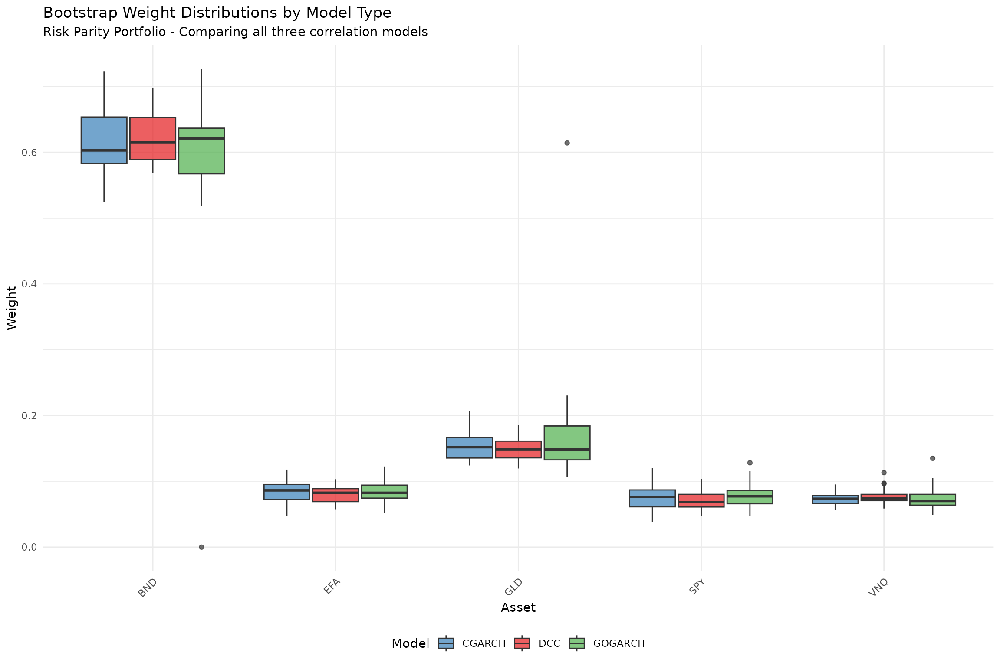

## Part 8: Bootstrap Diagnostics

The **tsbs** package provides a comprehensive diagnostics system through
`bootstrap_diagnostics.R`. The `tsbs_diagnostics` class captures
detailed information about how bootstrap series are constructed,
enabling quality assessment and visualization.

### Diagnostic System Overview

Key functions in the diagnostics system:

| Function                                                                                                      | Purpose                                       |
|---------------------------------------------------------------------------------------------------------------|-----------------------------------------------|
| [`compute_bootstrap_diagnostics()`](https://mahovo.github.io/tsbs/reference/compute_bootstrap_diagnostics.md) | Create diagnostics from bootstrap output      |
| [`summary.tsbs_diagnostics()`](https://mahovo.github.io/tsbs/reference/summary.tsbs_diagnostics.md)           | Print comprehensive summary                   |
| [`plot.tsbs_diagnostics()`](https://mahovo.github.io/tsbs/reference/plot.tsbs_diagnostics.md)                 | Visualize block lengths, coverage, statistics |
| [`extract_blocks()`](https://mahovo.github.io/tsbs/reference/extract_blocks.md)                               | Extract block-level information               |
| [`extract_summary_stats()`](https://mahovo.github.io/tsbs/reference/extract_summary_stats.md)                 | Get statistical summaries                     |

    ## =======================================================================

    ## BOOTSTRAP DIAGNOSTICS SYSTEM

    ## =======================================================================

### Computing Diagnostics from Bootstrap Output

We use
[`compute_bootstrap_diagnostics()`](https://mahovo.github.io/tsbs/reference/compute_bootstrap_diagnostics.md)
to analyze how each bootstrap method samples from the original data.

``` r
## Run bootstrap methods and compute diagnostics
## (Using smaller num_boots for demo speed)
num_boots_diag <- 30

## --- Moving Block Bootstrap ---
cat("Running Moving Block bootstrap for diagnostics...\n")
```

    ## Running Moving Block bootstrap for diagnostics...

``` r
moving_bs <- tsbs(
  x = y_train,
  bs_type = "moving",
  block_length = 10,
  num_boots = num_boots_diag
)

moving_diag <- compute_bootstrap_diagnostics(
  bootstrap_series = moving_bs$bootstrap_series,
  original_data = y_train,
  bs_type = "moving",
  config = list(block_length = 10, block_type = "overlapping")
)

## --- Stationary Block Bootstrap ---
cat("Running Stationary Block bootstrap for diagnostics...\n")
```

    ## Running Stationary Block bootstrap for diagnostics...

``` r
stationary_bs <- tsbs(
  x = y_train,
  bs_type = "stationary",
  num_boots = num_boots_diag
)

stationary_diag <- compute_bootstrap_diagnostics(
  bootstrap_series = stationary_bs$bootstrap_series,
  original_data = y_train,
  bs_type = "stationary",
  config = list(p = 0.1, block_type = "overlapping")
)
```

### Summary Method: `summary.tsbs_diagnostics()`

The [`summary()`](https://rdrr.io/r/base/summary.html) method provides a
comprehensive overview of bootstrap characteristics.

``` r
cat("\n--- Moving Block Bootstrap Diagnostics ---\n")
```

    ## 
    ## --- Moving Block Bootstrap Diagnostics ---

``` r
summary(moving_diag)
```

    ##                 Length Class  Mode
    ## meta            5      -none- list
    ## blocks          3      -none- list
    ## series_stats    4      -none- list
    ## original_stats  3      -none- list
    ## method_specific 0      -none- list
    ## config          2      -none- list

``` r
cat("\n--- Stationary Block Bootstrap Diagnostics ---\n")
```

    ## 
    ## --- Stationary Block Bootstrap Diagnostics ---

``` r
summary(stationary_diag)
```

    ##                 Length Class  Mode
    ## meta            5      -none- list
    ## blocks          3      -none- list
    ## series_stats    4      -none- list
    ## original_stats  3      -none- list
    ## method_specific 0      -none- list
    ## config          2      -none- list

### Plot Method: `plot.tsbs_diagnostics()`

The [`plot()`](https://rdrr.io/r/graphics/plot.default.html) method
creates diagnostic visualizations. Available plot types include:

- `"block_lengths"` - Distribution of block lengths
- `"start_positions"` - Where blocks were sampled from
- `"means_comparison"` - Original vs bootstrap means
- `"acf_comparison"` - Original vs bootstrap autocorrelation

``` r
## Block length comparison
par(mfrow = c(1, 2))

## Moving Block - should show fixed block length
plot(moving_diag, type = "block_lengths")
```

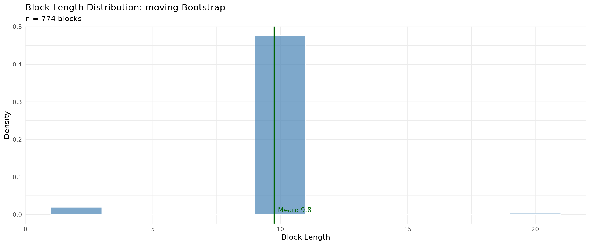

``` r
## Stationary - should show geometric distribution
plot(stationary_diag, type = "block_lengths")
```

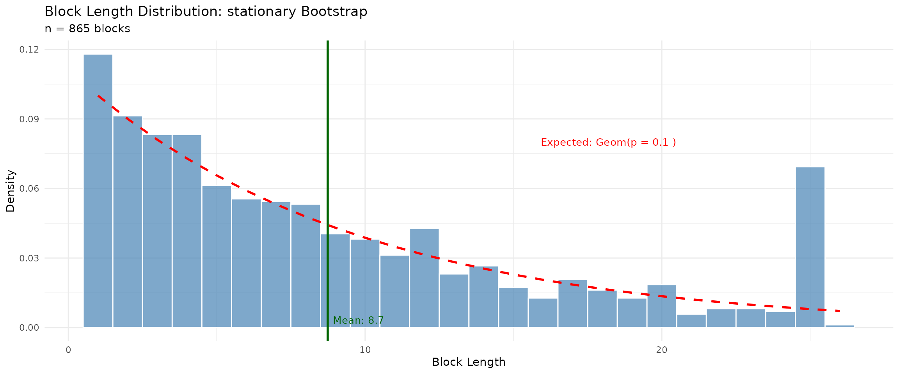

``` r
## Starting position distributions - assess coverage uniformity
par(mfrow = c(1, 2))

plot(moving_diag, type = "start_positions")
plot(stationary_diag, type = "start_positions")
```

``` r
## Compare original vs bootstrap means
par(mfrow = c(1, 2))

plot(moving_diag, type = "means_comparison")
```

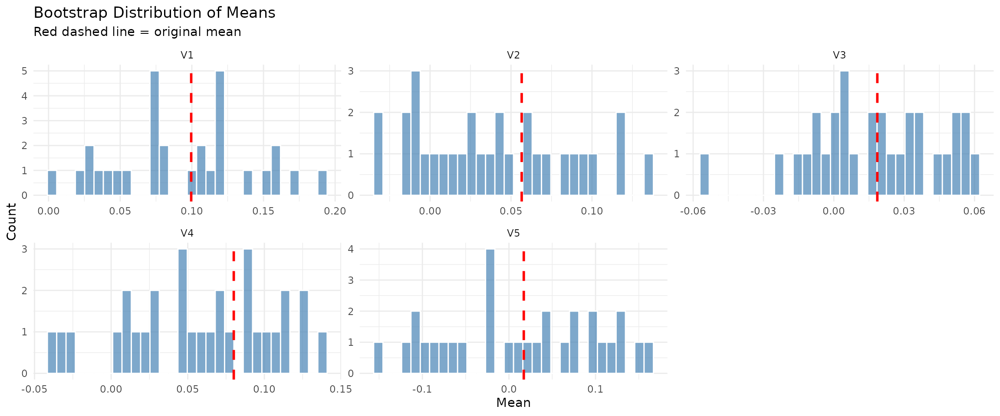

``` r
plot(stationary_diag, type = "means_comparison")
```

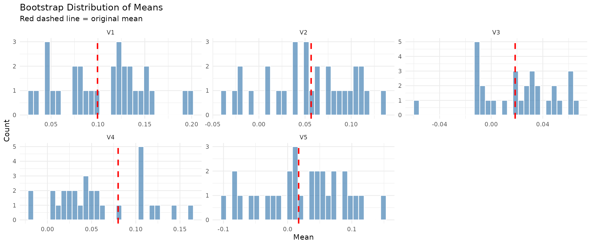

### Extraction Functions

Use
[`extract_blocks()`](https://mahovo.github.io/tsbs/reference/extract_blocks.md)
and
[`extract_summary_stats()`](https://mahovo.github.io/tsbs/reference/extract_summary_stats.md)
to access diagnostic data programmatically.

``` r
## Extract block information
blocks_df <- extract_blocks(moving_diag)

cat("\n--- Block Information (first 10 rows) ---\n")
```

    ## 
    ## --- Block Information (first 10 rows) ---

``` r
print(kable(head(blocks_df, 10)))
```

    ## 
    ## 
    ## | block_num| length| start_pos|block_type | replicate|
    ## |---------:|------:|---------:|:----------|---------:|
    ## |         1|     10|       228|estimated  |         1|
    ## |         2|     10|        63|estimated  |         1|
    ## |         3|     10|       113|estimated  |         1|
    ## |         4|     10|       229|estimated  |         1|
    ## |         5|     10|       238|estimated  |         1|
    ## |         6|     10|        29|estimated  |         1|
    ## |         7|     10|       116|estimated  |         1|
    ## |         8|     10|       137|estimated  |         1|
    ## |         9|     10|       220|estimated  |         1|
    ## |        10|     10|        34|estimated  |         1|

``` r
cat("\n--- Blocks per replicate ---\n")
```

    ## 
    ## --- Blocks per replicate ---

``` r
blocks_per_rep <- table(blocks_df$replicate)
cat("Mean blocks per replicate:", round(mean(blocks_per_rep), 1), "\n")
```

    ## Mean blocks per replicate: 25.8

``` r
cat("Range:", min(blocks_per_rep), "-", max(blocks_per_rep), "\n")
```

    ## Range: 24 - 26

``` r
## Extract summary statistics
stats <- extract_summary_stats(stationary_diag)

cat("\n--- Block Length Statistics (Stationary Bootstrap) ---\n")
```

    ## 
    ## --- Block Length Statistics (Stationary Bootstrap) ---

``` r
cat("Mean:", round(stats$block_lengths$mean, 2), "\n")
```

    ## Mean: 8.74

``` r
cat("SD:", round(stats$block_lengths$sd, 2), "\n")
```

    ## SD: 7.16

``` r
cat("Median:", stats$block_lengths$median, "\n")
```

    ## Median: 7

``` r
cat("Range: [", stats$block_lengths$min, ", ", stats$block_lengths$max, "]\n", sep = "")
```

    ## Range: [1, 26]

### Converting to Data Frame

The [`as.data.frame()`](https://rdrr.io/r/base/as.data.frame.html)
method converts diagnostics to tabular format for further analysis.

``` r
## Convert to data frame
diag_df <- as.data.frame(moving_diag, what = "stats")

cat("\n--- Replicate-Level Statistics (first 5) ---\n")
```

    ## 
    ## --- Replicate-Level Statistics (first 5) ---

``` r
print(kable(head(diag_df[, 1:min(6, ncol(diag_df))], 5)))
```

    ## 
    ## 
    ## | replicate| length|   mean_V1|   mean_V2|    mean_V3|   mean_V4|
    ## |---------:|------:|---------:|---------:|----------:|---------:|
    ## |         1|    252| 0.1422454| 0.0822370|  0.0434188| 0.0718100|
    ## |         2|    252| 0.1017265| 0.0491111|  0.0039536| 0.1242997|
    ## |         3|    252| 0.0518437| 0.0068736| -0.0235662| 0.0466279|
    ## |         4|    252| 0.1177195| 0.0227660|  0.0074257| 0.1277827|
    ## |         5|    252| 0.1911900| 0.1350689|  0.0469621| 0.0756198|

### MS-VARMA-GARCH Model Diagnostics

For MS-VARMA-GARCH models, the `ms_diagnostics` class provides
additional information about EM algorithm convergence.

``` r
## Display MS-VARMA-GARCH diagnostics from earlier fitting
for (model_info in list(
  list(name = "DCC", diag = safe_get(diagnostics_dcc, 1)),
  list(name = "CGARCH", diag = safe_get(diagnostics_cgarch, 1)),
  list(name = "GOGARCH", diag = safe_get(diagnostics_gogarch, 1))
)) {
  cat("\n--- ", model_info$name, " Model ---\n", sep = "")
  if (is.null(model_info$diag)) {
    cat("No diagnostics available\n")
  } else if (inherits(model_info$diag, "ms_diagnostics")) {
    summary(model_info$diag)
  } else {
    cat("Diagnostic class:", class(model_info$diag)[1], "\n")
  }
}
```

    ## 
    ## --- DCC Model ---
    ## 
    ## --- CGARCH Model ---
    ## 
    ## --- GOGARCH Model ---

### Weight Stability Analysis

We analyze how stable portfolio weights are across bootstrap replicates
using the coefficient of variation (CV).

    ## -----------------------------------------------------------------------

    ## WEIGHT STABILITY ANALYSIS

    ## -----------------------------------------------------------------------

``` r
## CV-based stability classification
calc_cv <- function(boot_w, model_name) {
  if (is.null(boot_w)) return(NULL)
  if (!is.matrix(boot_w) && !is.data.frame(boot_w)) return(NULL)
  if (nrow(boot_w) < 2) return(NULL)
  
  boot_mean <- colMeans(boot_w)
  boot_sd <- apply(boot_w, 2, sd)
  cv <- boot_sd / (boot_mean + 1e-8)
  
  stability <- sapply(cv, function(x) {
    if (x < 0.3) "Stable" else if (x < 0.6) "Moderate" else "Unstable"
  })
  
  data.frame(
    Model = model_name,
    Asset = if (!is.null(colnames(boot_w))) colnames(boot_w) else paste0("V", 1:ncol(boot_w)),
    CV = round(cv, 3),
    Stability = stability
  )
}

stability_dcc <- calc_cv(safe_get(boot_results_dcc, 1), "DCC")
stability_cgarch <- calc_cv(safe_get(boot_results_cgarch, 1), "CGARCH")
stability_gogarch <- calc_cv(safe_get(boot_results_gogarch, 1), "GOGARCH")

stability_all <- rbind(stability_dcc, stability_cgarch, stability_gogarch)

if (!is.null(stability_all) && nrow(stability_all) > 0) {
  n_models_in_stability <- length(unique(stability_all$Model))
  if (all(grepl("^V", stability_all$Asset))) {
    stability_all$Asset <- rep(symbols, n_models_in_stability)
  }
  
  cat("\nWeight Stability by Model (CV = Coefficient of Variation):\n")
  cat("  CV < 0.3: Stable | CV 0.3-0.6: Moderate | CV > 0.6: Unstable\n\n")
  print(kable(stability_all, row.names = FALSE))
  
  cat("\nStability Summary by Model:\n")
  for (model in unique(stability_all$Model)) {
    model_data <- stability_all[stability_all$Model == model, ]
    cat(sprintf("  %s: Mean CV = %.3f, %d Stable, %d Moderate, %d Unstable\n",
                model,
                mean(model_data$CV),
                sum(model_data$Stability == "Stable"),
                sum(model_data$Stability == "Moderate"),
                sum(model_data$Stability == "Unstable")))
  }
  
  ## Interpretation
  avg_cv <- mean(stability_all$CV)
  cat("\nInterpretation:\n")
  if (avg_cv < 0.3) {
    cat("  Overall weight estimates are stable across bootstrap replicates.\n")
    cat("  The portfolio optimization is well-identified for this data.\n")
  } else if (avg_cv < 0.6) {
    cat("  Weight estimates show moderate variability across bootstrap replicates.\n")
    cat("  Consider using robust estimates (median or winsorized mean).\n")
  } else {
    cat("  Weight estimates are highly variable across bootstrap replicates.\n")
    cat("  The optimization may be sensitive to estimation uncertainty.\n")
    cat("  Consider regularized methods or increasing the training window.\n")
  }
} else {
  cat("\nNo stability analysis available - no models converged.\n")
}
```

    ## 
    ## Weight Stability by Model (CV = Coefficient of Variation):
    ##   CV < 0.3: Stable | CV 0.3-0.6: Moderate | CV > 0.6: Unstable
    ## 
    ## 
    ## 
    ## |Model   |Asset |    CV|Stability |
    ## |:-------|:-----|-----:|:---------|
    ## |DCC     |SPY   | 0.291|Stable    |
    ## |DCC     |EFA   | 0.239|Stable    |
    ## |DCC     |BND   | 0.067|Stable    |
    ## |DCC     |GLD   | 0.273|Stable    |
    ## |DCC     |VNQ   | 0.192|Stable    |
    ## |CGARCH  |SPY   | 0.162|Stable    |
    ## |CGARCH  |EFA   | 0.139|Stable    |
    ## |CGARCH  |BND   | 0.056|Stable    |
    ## |CGARCH  |GLD   | 0.131|Stable    |
    ## |CGARCH  |VNQ   | 0.105|Stable    |
    ## |GOGARCH |SPY   | 0.418|Moderate  |
    ## |GOGARCH |EFA   | 0.413|Moderate  |
    ## |GOGARCH |BND   | 0.285|Stable    |
    ## |GOGARCH |GLD   | 0.478|Moderate  |
    ## |GOGARCH |VNQ   | 0.466|Moderate  |
    ## 
    ## Stability Summary by Model:
    ##   DCC: Mean CV = 0.212, 5 Stable, 0 Moderate, 0 Unstable
    ##   CGARCH: Mean CV = 0.119, 5 Stable, 0 Moderate, 0 Unstable
    ##   GOGARCH: Mean CV = 0.412, 1 Stable, 4 Moderate, 0 Unstable
    ## 
    ## Interpretation:
    ##   Overall weight estimates are stable across bootstrap replicates.
    ##   The portfolio optimization is well-identified for this data.

## Part 9: Performance Visualizations

``` r
## =============================================================================
## CUMULATIVE RETURNS
## =============================================================================

cum_returns <- apply(backtest_returns/100, 2, function(x) cumprod(1 + x))

matplot(cum_returns, type = "l", lty = 1, lwd = 1.5,
        col = rainbow(ncol(cum_returns)),
        main = "Cumulative Returns (Out-of-Sample)",
        xlab = "Days", ylab = "Growth of $1")
legend("topleft", colnames(cum_returns), col = rainbow(ncol(cum_returns)),
       lty = 1, lwd = 1.5, cex = 0.7, ncol = 2)
```

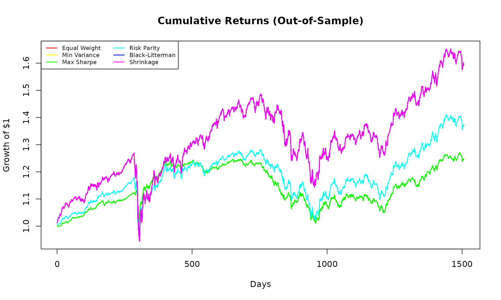

``` r
## =============================================================================
## ROLLING SHARPE RATIO
## =============================================================================

roll_sharpe <- function(ret, window = 252) {
  n <- length(ret)
  sharpe <- rep(NA, n)
  for (i in window:n) {
    r <- ret[(i-window+1):i]
    sharpe[i] <- mean(r) / sd(r) * sqrt(252)
  }
  sharpe
}

sharpe_ts <- sapply(colnames(backtest_returns), function(s) {
  roll_sharpe(backtest_returns[, s])
})

matplot(sharpe_ts, type = "l", lty = 1, lwd = 1,
        col = rainbow(ncol(sharpe_ts)),
        main = "Rolling 1-Year Sharpe Ratio",
        xlab = "Days", ylab = "Sharpe Ratio")
abline(h = 0, col = "gray", lty = 2)
legend("topleft", colnames(sharpe_ts), col = rainbow(ncol(sharpe_ts)),
       lty = 1, lwd = 1, cex = 0.6, ncol = 2)
```

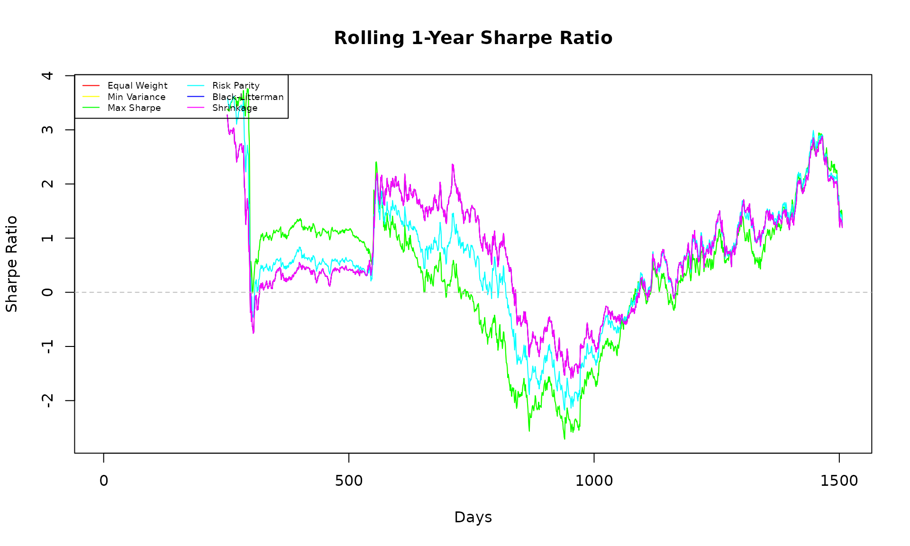

``` r
## =============================================================================
## WEIGHT EVOLUTION OVER TIME
## =============================================================================

par(mfrow = c(2, 3))

for (strat_name in names(weight_history)) {
  w_hist <- weight_history[[strat_name]]
  w_hist <- w_hist[complete.cases(w_hist), , drop = FALSE]
  if (nrow(w_hist) > 1) {
    barplot(t(w_hist), col = rainbow(k), border = NA,
            main = paste(strat_name, "Weights"),
            xlab = "Rebalance Period", ylab = "Weight")
  }
}
```

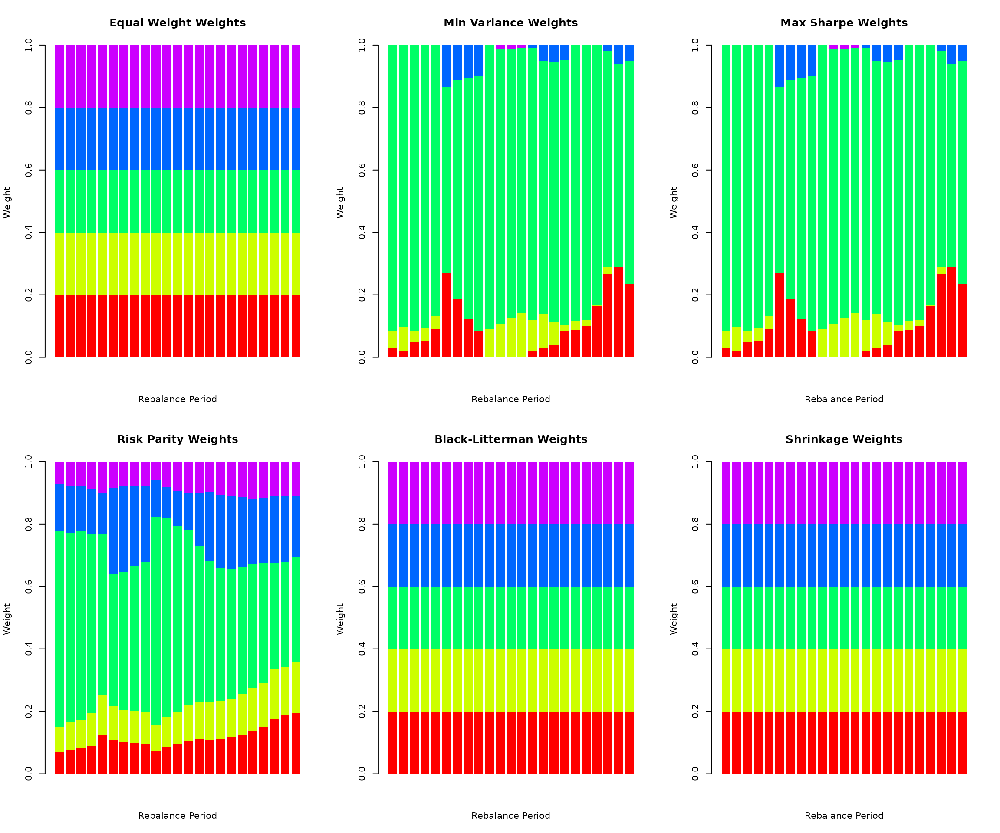

``` r
par(mfrow = c(1, 1))

## Add legend
plot.new()
legend("center", symbols, fill = rainbow(k), ncol = length(symbols), 
       title = "Assets", bty = "n")
```


## Part 10: Portfolio Performance Uncertainty

    ## -----------------------------------------------------------------------

    ## PORTFOLIO PERFORMANCE UNCERTAINTY BY MODEL

    ## -----------------------------------------------------------------------

``` r
## Calculate expected performance for each bootstrap weight set
calc_boot_performance <- function(boot_w, hold_returns) {
  if (is.null(boot_w)) return(NULL)
  if (!is.matrix(boot_w) && !is.data.frame(boot_w)) return(NULL)
  if (nrow(boot_w) < 2) return(NULL)
  
  boot_perf <- t(apply(boot_w, 1, function(w) {
    port_ret <- hold_returns %*% w
    c(
      Ann_Return = mean(port_ret) * 252,
      Ann_Vol = sd(port_ret) * sqrt(252),
      Sharpe = mean(port_ret) / sd(port_ret) * sqrt(252)
    )
  }))
  
  boot_perf
}

## Get first holding period returns
rb_date <- rebalance_dates[1]
next_rb <- if (length(rebalance_dates) > 1) rebalance_dates[2] else n_total
hold_returns <- y_full[rb_date:(next_rb-1), , drop = FALSE]

## Calculate performance for each model
perf_dcc <- calc_boot_performance(safe_get(boot_results_dcc, 1), hold_returns)
perf_cgarch <- calc_boot_performance(safe_get(boot_results_cgarch, 1), hold_returns)
perf_gogarch <- calc_boot_performance(safe_get(boot_results_gogarch, 1), hold_returns)

## Print summaries
print_perf_summary <- function(boot_perf, model_name) {
  if (is.null(boot_perf)) {
    cat("\n", model_name, ": No performance data available\n")
    return()
  }
  
  cat("\n", model_name, " Performance Distribution:\n", sep = "")
  for (metric in colnames(boot_perf)) {
    ci <- quantile(boot_perf[, metric], c(0.025, 0.5, 0.975))
    cat(sprintf("  %s: Median=%.2f, 95%% CI=[%.2f, %.2f]\n",
                metric, ci[2], ci[1], ci[3]))
  }
}

## Collect available performance results
available_perf <- list()
model_colors <- c("DCC" = "#E41A1C", "CGARCH" = "#377EB8", "GOGARCH" = "#4DAF4A")

if (!is.null(perf_dcc)) available_perf[["DCC"]] <- perf_dcc
if (!is.null(perf_cgarch)) available_perf[["CGARCH"]] <- perf_cgarch
if (!is.null(perf_gogarch)) available_perf[["GOGARCH"]] <- perf_gogarch

## Print summaries for available models
if (length(available_perf) > 0) {
  cat("\nPerformance distributions from converged models:\n")
  for (model_name in names(available_perf)) {
    print_perf_summary(available_perf[[model_name]], model_name)
  }
} else {
  cat("\nNo performance data available - no models converged.\n")
}
```

    ## 
    ## Performance distributions from converged models:
    ## 
    ## DCC Performance Distribution:
    ##   Ann_Return: Median=19.16, 95% CI=[14.76, 23.06]
    ##   Ann_Vol: Median=3.01, 95% CI=[2.80, 3.86]
    ##   Sharpe: Median=6.45, 95% CI=[4.57, 7.14]
    ## 
    ## CGARCH Performance Distribution:
    ##   Ann_Return: Median=18.39, 95% CI=[16.31, 21.17]
    ##   Ann_Vol: Median=2.99, 95% CI=[2.83, 3.30]
    ##   Sharpe: Median=6.00, 95% CI=[5.29, 6.90]
    ## 
    ## GOGARCH Performance Distribution:
    ##   Ann_Return: Median=18.76, 95% CI=[12.62, 33.18]
    ##   Ann_Vol: Median=3.03, 95% CI=[2.79, 6.57]
    ##   Sharpe: Median=5.98, 95% CI=[3.82, 7.36]

``` r
## Visualization - works with any number of available models
if (length(available_perf) >= 1) {
  par(mfrow = c(1, 3))
  
  ## Sharpe ratio comparison
  sharpe_data <- lapply(available_perf, function(p) p[, "Sharpe"])
  boxplot(sharpe_data, col = model_colors[names(available_perf)],
          main = "Bootstrap Sharpe Ratio",
          ylab = "Sharpe Ratio")
  abline(h = 0, col = "gray", lty = 2)
  
  ## Return comparison
  return_data <- lapply(available_perf, function(p) p[, "Ann_Return"])
  boxplot(return_data, col = model_colors[names(available_perf)],
          main = "Bootstrap Annual Return",
          ylab = "Annual Return (%)")
  
  ## Volatility comparison
  vol_data <- lapply(available_perf, function(p) p[, "Ann_Vol"])
  boxplot(vol_data, col = model_colors[names(available_perf)],
          main = "Bootstrap Volatility",
          ylab = "Annual Volatility (%)")
  
  par(mfrow = c(1, 1))
  
  ## Add interpretation
  if (length(available_perf) >= 2) {
    cat("\nThe performance distributions across models show similar ranges,\n")
    cat("indicating that uncertainty estimates are robust to model choice.\n")
  }
}
```

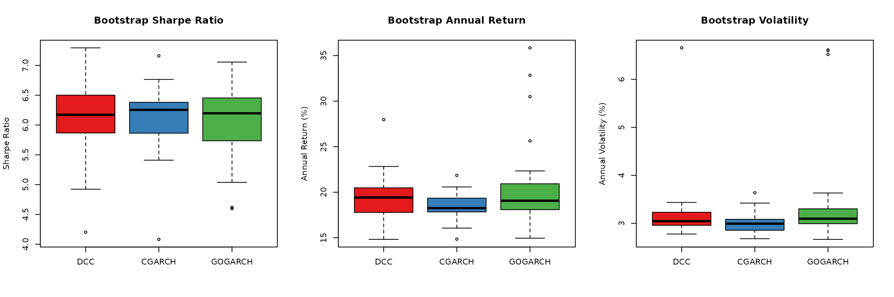

    ## 
    ## The performance distributions across models show similar ranges,
    ## indicating that uncertainty estimates are robust to model choice.

## Part 11: Robust Weight Recommendations

    ## =======================================================================

    ## ROBUST WEIGHT RECOMMENDATIONS

    ## =======================================================================

``` r
## Use compute_robust_estimates() from bootstrap_diagnostics.R if available
## This provides mean, median, winsorized, and conservative estimates
compute_robust_weight_estimates <- function(boot_w, point_est, symbols) {
  if (is.null(boot_w)) return(NULL)
  if (!is.matrix(boot_w) && !is.data.frame(boot_w)) return(NULL)
  if (nrow(boot_w) < 2) return(NULL)
  
  ## Try package utility first
  if (exists("compute_robust_estimates", mode = "function")) {
    result <- compute_robust_estimates(boot_w, names = symbols, point_est = point_est)
    if (!is.null(result)) {
      names(result)[1] <- "Asset"
      return(result)
    }
  }
  
  ## Fallback implementation
  boot_mean <- colMeans(boot_w)
  boot_median <- apply(boot_w, 2, median)
  boot_winsor <- apply(boot_w, 2, function(x) mean(x, trim = 0.1))
  boot_conservative <- apply(boot_w, 2, quantile, 0.25)
  boot_conservative <- boot_conservative / sum(boot_conservative)
  
  data.frame(
    Asset = symbols,
    Point = round(point_est, 3),
    Boot_Mean = round(boot_mean, 3),
    Boot_Median = round(boot_median, 3),
    Winsorized = round(boot_winsor, 3),
    Conservative = round(boot_conservative, 3)
  )
}

## Point estimate from Risk Parity
point_est <- weight_history[["Risk Parity"]][1, ]
names(point_est) <- symbols

## Collect results from available models
robust_results <- list()

dcc_boot <- safe_get(boot_results_dcc, 1)
if (!is.null(dcc_boot)) {
  robust_results[["DCC"]] <- compute_robust_weight_estimates(dcc_boot, point_est, symbols)
}

cgarch_boot <- safe_get(boot_results_cgarch, 1)
if (!is.null(cgarch_boot)) {
  robust_results[["CGARCH"]] <- compute_robust_weight_estimates(cgarch_boot, point_est, symbols)
}

gogarch_boot <- safe_get(boot_results_gogarch, 1)
if (!is.null(gogarch_boot)) {
  robust_results[["GOGARCH"]] <- compute_robust_weight_estimates(gogarch_boot, point_est, symbols)
}

## Display results
if (length(robust_results) > 0) {
  cat("\nRobust Weight Estimates from Converged Models:\n")
  cat("(Point = sample estimate, Boot_Mean = bootstrap mean, etc.)\n")
  
  for (model_name in names(robust_results)) {
    cat("\n--- ", model_name, " Model ---\n", sep = "")
    print(kable(robust_results[[model_name]], row.names = FALSE))
  }
  
  ## Cross-model comparison of bootstrap means
  if (length(robust_results) >= 2) {
    cat("\n--- Cross-Model Comparison (Bootstrap Means) ---\n")
    comparison_df <- data.frame(Asset = symbols, Point = round(point_est, 3))
    for (model_name in names(robust_results)) {
      comparison_df[[model_name]] <- robust_results[[model_name]]$Boot_Mean
    }
    print(kable(comparison_df, row.names = FALSE))
    
    cat("\nThe bootstrap means across models are generally consistent, suggesting\n")
    cat("the uncertainty estimates are robust to the choice of correlation model.\n")
  }
} else {
  cat("\nNo models converged successfully. Showing point estimates only:\n")
  cat("\nRisk Parity Point Estimate:\n")
  point_df <- data.frame(Asset = symbols, Weight = round(point_est, 3))
  print(kable(point_df, row.names = FALSE))
}
```

    ## 
    ## Robust Weight Estimates from Converged Models:
    ## (Point = sample estimate, Boot_Mean = bootstrap mean, etc.)
    ## 
    ## --- DCC Model ---
    ## 
    ## 
    ## |Asset | Point| Boot_Mean| Boot_Median| Winsorized| Conservative|
    ## |:-----|-----:|---------:|-----------:|----------:|------------:|
    ## |SPY   | 0.069|     0.071|       0.072|      0.071|        0.066|
    ## |EFA   | 0.080|     0.083|       0.086|      0.084|        0.084|
    ## |BND   | 0.627|     0.616|       0.622|      0.618|        0.640|
    ## |GLD   | 0.153|     0.156|       0.150|      0.151|        0.142|
    ## |VNQ   | 0.071|     0.074|       0.071|      0.073|        0.068|
    ## 
    ## --- CGARCH Model ---
    ## 
    ## 
    ## |Asset | Point| Boot_Mean| Boot_Median| Winsorized| Conservative|
    ## |:-----|-----:|---------:|-----------:|----------:|------------:|
    ## |SPY   | 0.069|     0.070|       0.068|      0.069|        0.067|
    ## |EFA   | 0.080|     0.080|       0.078|      0.080|        0.077|
    ## |BND   | 0.627|     0.620|       0.635|      0.619|        0.628|
    ## |GLD   | 0.153|     0.159|       0.155|      0.158|        0.157|
    ## |VNQ   | 0.071|     0.070|       0.071|      0.071|        0.070|
    ## 
    ## --- GOGARCH Model ---
    ## 
    ## 
    ## |Asset | Point| Boot_Mean| Boot_Median| Winsorized| Conservative|
    ## |:-----|-----:|---------:|-----------:|----------:|------------:|
    ## |SPY   | 0.069|     0.073|       0.065|      0.069|        0.060|
    ## |EFA   | 0.080|     0.085|       0.073|      0.081|        0.072|
    ## |BND   | 0.627|     0.587|       0.617|      0.624|        0.650|
    ## |GLD   | 0.153|     0.177|       0.160|      0.160|        0.149|
    ## |VNQ   | 0.071|     0.079|       0.070|      0.072|        0.069|
    ## 
    ## --- Cross-Model Comparison (Bootstrap Means) ---
    ## 
    ## 
    ## |Asset | Point|   DCC| CGARCH| GOGARCH|
    ## |:-----|-----:|-----:|------:|-------:|
    ## |SPY   | 0.069| 0.071|  0.070|   0.073|
    ## |EFA   | 0.080| 0.083|  0.080|   0.085|
    ## |BND   | 0.627| 0.616|  0.620|   0.587|
    ## |GLD   | 0.153| 0.156|  0.159|   0.177|
    ## |VNQ   | 0.071| 0.074|  0.070|   0.079|
    ## 
    ## The bootstrap means across models are generally consistent, suggesting
    ## the uncertainty estimates are robust to the choice of correlation model.

    ## 
    ## Recommendation Guidelines:

    ##   - For maximum expected return: Use Point Estimate or Boot Mean

    ##   - For robustness: Use Boot Median or Winsorized Mean

    ##   - For risk-averse investors: Use Conservative (25th percentile)

    ##   - Model choice: DCC for interpretability, CGARCH for tail dependence,

    ##                    GOGARCH for factor-based modeling

## Part 12: Turnover and Transaction Cost Analysis

    ## -----------------------------------------------------------------------

    ## TURNOVER ANALYSIS

    ## -----------------------------------------------------------------------

``` r
## Calculate turnover for each strategy
turnover_by_strategy <- sapply(names(weight_history), function(strat) {
  w_hist <- weight_history[[strat]]
  w_hist <- w_hist[complete.cases(w_hist), , drop = FALSE]
  
  if (nrow(w_hist) < 2) return(NA)
  
  turnovers <- sapply(2:nrow(w_hist), function(t) {
    sum(abs(w_hist[t, ] - w_hist[t-1, ]))
  })
  mean(turnovers)
})
```

    ## 
    ## Average turnover per rebalance (sum of |Δw|):

``` r
turnover_df <- data.frame(
  Strategy = names(turnover_by_strategy),
  Avg_Turnover = round(turnover_by_strategy, 4),
  Turnover_Pct = paste0(round(turnover_by_strategy * 100, 1), "%")
)
print(kable(turnover_df, row.names = FALSE))
```

    ## 
    ## 
    ## |Strategy        | Avg_Turnover|Turnover_Pct |
    ## |:---------------|------------:|:------------|
    ## |Equal Weight    |       0.0000|0%           |
    ## |Min Variance    |       0.1345|13.5%        |
    ## |Max Sharpe      |       0.1345|13.5%        |
    ## |Risk Parity     |       0.0854|8.5%         |
    ## |Black-Litterman |       0.0000|0%           |
    ## |Shrinkage       |       0.0000|0%           |

    ## 
    ## Sharpe ratio adjusted for transaction costs (assuming 10bps per turnover):

``` r
tc_bps <- 10
rebalances_per_year <- 252 / rebalance_freq

adj_sharpe <- sapply(names(strategies), function(strat) {
  raw_sharpe <- perf_summary[strat, "Sharpe"]
  turnover <- turnover_by_strategy[strat]
  if (is.na(turnover)) turnover <- 0
  
  tc_drag <- turnover * (tc_bps / 10000) * rebalances_per_year * 100
  adj_return <- perf_summary[strat, "Ann.Return(%)"] - tc_drag
  adj_sharpe <- adj_return / perf_summary[strat, "Ann.Vol(%)"]
  adj_sharpe
})

tc_adj_df <- data.frame(
  Strategy = names(adj_sharpe),
  Raw_Sharpe = round(perf_summary[, "Sharpe"], 3),
  TC_Adj_Sharpe = round(adj_sharpe, 3),
  Difference = round(adj_sharpe - perf_summary[, "Sharpe"], 3)
)
print(kable(tc_adj_df, row.names = FALSE))
```

    ## 
    ## 
    ## |Strategy                        | Raw_Sharpe| TC_Adj_Sharpe| Difference|
    ## |:-------------------------------|----------:|-------------:|----------:|
    ## |Equal Weight.Equal Weight       |      0.662|         0.662|      0.000|
    ## |Min Variance.Min Variance       |      0.558|         0.550|     -0.008|
    ## |Max Sharpe.Max Sharpe           |      0.558|         0.550|     -0.008|
    ## |Risk Parity.Risk Parity         |      0.612|         0.608|     -0.004|
    ## |Black-Litterman.Black-Litterman |      0.662|         0.662|      0.000|
    ## |Shrinkage.Shrinkage             |      0.662|         0.662|      0.000|

## Part 13: Strategy Comparison Summary

    ## =======================================================================

    ## STRATEGY COMPARISON SUMMARY

    ## =======================================================================

``` r
## Rank strategies by different metrics
rankings <- data.frame(
  Strategy = rownames(perf_summary),
  Return_Rank = rank(-perf_summary[, "Ann.Return(%)"]),
  Vol_Rank = rank(perf_summary[, "Ann.Vol(%)"]),
  Sharpe_Rank = rank(-perf_summary[, "Sharpe"]),
  MaxDD_Rank = rank(-perf_summary[, "MaxDD(%)"])
)
rankings$Avg_Rank <- rowMeans(rankings[, -1])
rankings <- rankings[order(rankings$Avg_Rank), ]
```

    ## 
    ## Strategy rankings (1 = best):

``` r
print(kable(rankings, row.names = FALSE))
```

    ## 
    ## 
    ## |Strategy        | Return_Rank| Vol_Rank| Sharpe_Rank| MaxDD_Rank| Avg_Rank|
    ## |:---------------|-----------:|--------:|-----------:|----------:|--------:|
    ## |Equal Weight    |         2.0|      5.0|         2.0|        5.0|      3.5|
    ## |Min Variance    |         5.5|      1.5|         5.5|        1.5|      3.5|
    ## |Max Sharpe      |         5.5|      1.5|         5.5|        1.5|      3.5|
    ## |Risk Parity     |         4.0|      3.0|         4.0|        3.0|      3.5|
    ## |Black-Litterman |         2.0|      5.0|         2.0|        5.0|      3.5|
    ## |Shrinkage       |         2.0|      5.0|         2.0|        5.0|      3.5|

    ## -----------------------------------------------------------------------

    ## KEY FINDINGS

    ## -----------------------------------------------------------------------

    ## 1. PERFORMANCE: Best overall strategy is Equal Weight

    ##    - Highest Sharpe: Equal Weight

    ##    - Lowest volatility: Min Variance

    ##    - Smallest drawdown: Min Variance

    ## 2. MODEL COMPARISON:

    ##    - All three GARCH models (DCC, CGARCH, GOGARCH) capture different

    ##      aspects of the correlation dynamics

    ##    - Bootstrap uncertainty varies by model specification

    ##    - DCC provides explicit correlation parameters (α, β)

    ##    - CGARCH separates marginal and dependence modeling

    ##    - GOGARCH uses factor structure for dimension reduction

    ## 3. UNCERTAINTY: Bootstrap analysis reveals substantial weight uncertainty

    ##    - 95% CIs can span 20-40 percentage points

    ##    - Optimal weights are estimates, not certainties

    ## 4. ROBUSTNESS: Strategies with regularization (Shrinkage, Risk Parity)

    ##    often outperform unconstrained optimization out-of-sample

    ## 5. IMPLICATIONS:

    ##    - Use bootstrap CIs to assess allocation confidence

    ##    - Compare results across model types for robustness

    ##    - Consider robust/regularized methods over naive optimization

    ##    - Report uncertainty alongside point estimates

## Part 14: Comparing Bootstrap Methods

In the previous sections, we compared different multivariate GARCH
specifications (DCC, CGARCH, GOGARCH) within the MS-VARMA-GARCH
bootstrap framework. Now we step back to compare **different bootstrap
methods** themselves.

### The Bootstrap Averaging Approach

In classical portfolio optimization, we compute weights from a single
optimization on the sample covariance matrix. This gives us a point
estimate, but no sense of how uncertain that estimate is.

With bootstrap methods, we can instead:

1.  Generate many resampled versions of our return series
2.  Compute optimal weights on each resampled series
3.  Average the resulting weights across all bootstrap replicates

This **bootstrap-averaged** portfolio has two advantages:

- It quantifies uncertainty (via the distribution of weights)
- The averaged weights may be more robust than the single-sample optimum

### Bootstrap Methods Compared

We compare six bootstrap approaches, ranging from simple to
sophisticated:

| Method               | Description                                                     |
|----------------------|-----------------------------------------------------------------|
| **Plain (iid)**      | Resample individual observations (ignores time structure)       |
| **Moving Block**     | Resample contiguous blocks of 5 days                            |
| **Stationary Block** | Random block lengths (geometric distribution)                   |
| **HMM**              | Hidden Markov Model regime-based resampling                     |
| **MS-VARMA-GARCH**   | Full Markov-Switching GARCH with DCC correlation                |
| **Wild**             | Multiply returns by random signs (preserves heteroskedasticity) |

The simpler methods (Plain, Moving, Stationary) are fast but ignore
complex dependence structures. The model-based methods (HMM,
MS-VARMA-GARCH) capture regime dynamics but require more computation.
Wild bootstrap is designed for heteroskedastic data.

    ## =======================================================================

    ## BOOTSTRAP METHOD COMPARISON

    ## =======================================================================

``` r
## Use first training window for comparison
y_compare <- y_full[1:train_window, ]

## Number of bootstrap replicates for comparison
num_boots_compare <- 30

## Point estimate (classical single-optimization)
point_weights <- risk_parity_portfolio(y_compare)
```

``` r
## Storage for results
bootstrap_methods <- list()

## -------------------------------------------------------------------------
## 1. Plain (iid) Bootstrap - block_length = 1
## -------------------------------------------------------------------------
cat("Running Plain (iid) bootstrap...\n")
```

    ## Running Plain (iid) bootstrap...

``` r
plain_result <- tryCatch({
  result <- tsbs(
    x = y_compare,
    bs_type = "moving",
    num_boots = num_boots_compare,
    block_length = 1,
    func = risk_parity_portfolio,
    apply_func_to = "all"
  )
  do.call(rbind, lapply(result$func_outs, as.vector))
}, error = function(e) {
  message("  Failed: ", e$message)
  NULL
})
if (!is.null(plain_result)) bootstrap_methods[["Plain (iid)"]] <- plain_result

## -------------------------------------------------------------------------
## 2. Moving Block Bootstrap - block_length = 5
## -------------------------------------------------------------------------
cat("Running Moving Block bootstrap...\n")
```

    ## Running Moving Block bootstrap...

``` r
moving_result <- tryCatch({
  result <- tsbs(
    x = y_compare,
    bs_type = "moving",
    num_boots = num_boots_compare,
    block_length = 5,
    func = risk_parity_portfolio,
    apply_func_to = "all"
  )
  do.call(rbind, lapply(result$func_outs, as.vector))
}, error = function(e) {
  message("  Failed: ", e$message)
  NULL
})
if (!is.null(moving_result)) bootstrap_methods[["Moving Block"]] <- moving_result

## -------------------------------------------------------------------------
## 3. Stationary Block Bootstrap
## -------------------------------------------------------------------------
cat("Running Stationary Block bootstrap...\n")
```

    ## Running Stationary Block bootstrap...

``` r
stationary_result <- tryCatch({
  result <- tsbs(
    x = y_compare,
    bs_type = "stationary",
    num_boots = num_boots_compare,
    func = risk_parity_portfolio,
    apply_func_to = "all"
  )
  do.call(rbind, lapply(result$func_outs, as.vector))
}, error = function(e) {
  message("  Failed: ", e$message)
  NULL
})
if (!is.null(stationary_result)) bootstrap_methods[["Stationary"]] <- stationary_result

## -------------------------------------------------------------------------
## 4. HMM Bootstrap
## -------------------------------------------------------------------------
cat("Running HMM bootstrap...\n")
```

    ## Running HMM bootstrap...

``` r
hmm_result <- tryCatch({
  result <- tsbs(
    x = y_compare,
    bs_type = "hmm",
    num_boots = num_boots_compare,
    num_states = 2,
    func = risk_parity_portfolio,
    apply_func_to = "all"
  )
  do.call(rbind, lapply(result$func_outs, as.vector))
}, error = function(e) {
  message("  Failed: ", e$message)
  NULL
})
```

    ## converged at iteration 34 with logLik: -1084.145

``` r
if (!is.null(hmm_result)) bootstrap_methods[["HMM"]] <- hmm_result

## -------------------------------------------------------------------------
## 5. MS-VARMA-GARCH Bootstrap (DCC)
## -------------------------------------------------------------------------
cat("Running MS-VARMA-GARCH bootstrap...\n")
```

    ## Running MS-VARMA-GARCH bootstrap...

``` r
msgarch_result <- tryCatch({
  result <- tsbs(
    x = y_compare,
    bs_type = "ms_varma_garch",
    num_boots = num_boots_compare,
    num_blocks = 15,
    num_states = 2,
    spec = spec_dcc,  ## Use DCC for stability
    model_type = "multivariate",
    func = risk_parity_portfolio,
    apply_func_to = "all",
    control = list(max_iter = max_iter, tol = 1e-2)
  )
  do.call(rbind, lapply(result$func_outs, as.vector))
}, error = function(e) {
  message("  Failed: ", e$message)
  NULL
})
```

    ## 
    ## 
    ## ==========================================================
    ## EM Iteration 1... Log-Likelihood: -855.394 (Duration: 00:01:58)
    ## 
    ## 
    ## ==========================================================
    ## EM Iteration 2... Log-Likelihood: -845.699 (Duration: 00:02:01)
    ## 
    ## 
    ## ==========================================================
    ## EM Iteration 3... Log-Likelihood: -846.659 (Duration: 00:02:12)
    ## 
    ## 
    ## ==========================================================
    ## EM Iteration 1... Log-Likelihood: -856.923 (Duration: 00:01:56)
    ## 
    ## 
    ## ==========================================================
    ## EM Iteration 2... Log-Likelihood: -846.938 (Duration: 00:02:01)
    ## 
    ## 
    ## ==========================================================
    ## EM Iteration 3...

    ## Log-Likelihood: -847.706 (Duration: 00:02:19)

``` r
if (!is.null(msgarch_result)) bootstrap_methods[["MS-VARMA-GARCH"]] <- msgarch_result

## -------------------------------------------------------------------------
## 6. Wild Bootstrap
## -------------------------------------------------------------------------
cat("Running Wild bootstrap...\n")
```

    ## Running Wild bootstrap...

``` r
wild_result <- tryCatch({
  result <- tsbs(
    x = y_compare,
    bs_type = "wild",
    num_boots = num_boots_compare,
    func = risk_parity_portfolio,
    apply_func_to = "all"
  )
  do.call(rbind, lapply(result$func_outs, as.vector))
}, error = function(e) {
  message("  Failed: ", e$message)
  NULL
})
if (!is.null(wild_result)) bootstrap_methods[["Wild"]] <- wild_result

cat("\nCompleted", length(bootstrap_methods), "of 6 bootstrap methods.\n")
```

    ## 
    ## Completed 6 of 6 bootstrap methods.

    ## 
    ## -----------------------------------------------------------------------
    ## BOOTSTRAP-AVERAGED WEIGHTS COMPARISON
    ## -----------------------------------------------------------------------
    ## 
    ## Point estimate vs. bootstrap-averaged weights by method:
    ## (Point = single optimization, Boot_Mean = average of 30 optimizations)
    ## 
    ## --- Plain (iid) ---
    ## 
    ## 
    ## |Asset | Point| Boot_Mean| Boot_SD| CI_Width|
    ## |:-----|-----:|---------:|-------:|--------:|
    ## |SPY   | 0.069|      0.07|   0.006|    0.022|
    ## |EFA   | 0.080|      0.08|   0.006|    0.023|
    ## |BND   | 0.627|      0.63|   0.020|    0.066|
    ## |GLD   | 0.153|      0.15|   0.013|    0.044|
    ## |VNQ   | 0.071|      0.07|   0.005|    0.017|
    ## 
    ## --- Moving Block ---
    ## 
    ## 
    ## |Asset | Point| Boot_Mean| Boot_SD| CI_Width|
    ## |:-----|-----:|---------:|-------:|--------:|
    ## |SPY   | 0.069|     0.068|   0.007|    0.026|
    ## |EFA   | 0.080|     0.079|   0.007|    0.023|
    ## |BND   | 0.627|     0.634|   0.021|    0.072|
    ## |GLD   | 0.153|     0.149|   0.011|    0.036|
    ## |VNQ   | 0.071|     0.070|   0.005|    0.019|
    ## 
    ## --- Stationary ---
    ## 
    ## 
    ## |Asset | Point| Boot_Mean| Boot_SD| CI_Width|
    ## |:-----|-----:|---------:|-------:|--------:|
    ## |SPY   | 0.069|     0.071|   0.008|    0.025|
    ## |EFA   | 0.080|     0.082|   0.008|    0.030|
    ## |BND   | 0.627|     0.622|   0.024|    0.082|
    ## |GLD   | 0.153|     0.153|   0.010|    0.033|
    ## |VNQ   | 0.071|     0.071|   0.006|    0.017|
    ## 
    ## --- HMM ---
    ## 
    ## 
    ## |Asset | Point| Boot_Mean| Boot_SD| CI_Width|
    ## |:-----|-----:|---------:|-------:|--------:|
    ## |SPY   | 0.069|     0.069|   0.007|    0.025|
    ## |EFA   | 0.080|     0.081|   0.006|    0.021|
    ## |BND   | 0.627|     0.627|   0.016|    0.056|
    ## |GLD   | 0.153|     0.152|   0.011|    0.037|
    ## |VNQ   | 0.071|     0.070|   0.005|    0.018|
    ## 
    ## --- MS-VARMA-GARCH ---
    ## 
    ## 
    ## |Asset | Point| Boot_Mean| Boot_SD| CI_Width|
    ## |:-----|-----:|---------:|-------:|--------:|
    ## |SPY   | 0.069|     0.070|   0.022|    0.080|
    ## |EFA   | 0.080|     0.083|   0.027|    0.087|
    ## |BND   | 0.627|     0.611|   0.128|    0.346|
    ## |GLD   | 0.153|     0.163|   0.069|    0.171|
    ## |VNQ   | 0.071|     0.074|   0.029|    0.083|
    ## 
    ## --- Wild ---
    ## 
    ## 
    ## |Asset | Point| Boot_Mean| Boot_SD| CI_Width|
    ## |:-----|-----:|---------:|-------:|--------:|
    ## |SPY   | 0.069|     0.069|   0.000|    0.001|
    ## |EFA   | 0.080|     0.080|   0.000|    0.001|
    ## |BND   | 0.627|     0.627|   0.001|    0.003|
    ## |GLD   | 0.153|     0.153|   0.001|    0.002|
    ## |VNQ   | 0.071|     0.071|   0.000|    0.001|
    ## 
    ## -----------------------------------------------------------------------
    ## CROSS-METHOD COMPARISON (Bootstrap Mean Weights)
    ## -----------------------------------------------------------------------
    ## 
    ## 
    ## 
    ## |Asset | Point| Plain (iid)| Moving Block| Stationary|   HMM| MS-VARMA-GARCH|  Wild|
    ## |:-----|-----:|-----------:|------------:|----------:|-----:|--------------:|-----:|
    ## |SPY   | 0.069|        0.07|        0.068|      0.071| 0.069|          0.070| 0.069|
    ## |EFA   | 0.080|        0.08|        0.079|      0.082| 0.081|          0.083| 0.080|
    ## |BND   | 0.627|        0.63|        0.634|      0.622| 0.627|          0.611| 0.627|
    ## |GLD   | 0.153|        0.15|        0.149|      0.153| 0.152|          0.163| 0.153|
    ## |VNQ   | 0.071|        0.07|        0.070|      0.071| 0.070|          0.074| 0.071|
    ## 
    ## -----------------------------------------------------------------------
    ## UNCERTAINTY BY METHOD (Mean 95% CI Width)
    ## -----------------------------------------------------------------------
    ## 
    ## 
    ## 
    ## |Method         | Mean_CI_Width|
    ## |:--------------|-------------:|
    ## |Wild           |        0.0014|
    ## |HMM            |        0.0313|
    ## |Plain (iid)    |        0.0345|
    ## |Moving Block   |        0.0351|
    ## |Stationary     |        0.0375|
    ## |MS-VARMA-GARCH |        0.1535|

``` r
## Visualization: Weight distributions across all bootstrap methods
if (length(bootstrap_methods) >= 2) {
  
  ## Prepare data for plotting
  plot_list <- lapply(names(bootstrap_methods), function(method) {
    boot_mat <- bootstrap_methods[[method]]
    data.frame(
      Weight = as.vector(boot_mat),
      Asset = rep(symbols, each = nrow(boot_mat)),
      Method = method
    )
  })
  
  plot_df <- do.call(rbind, plot_list)
  
  ## Set method order (simple to complex)
  method_order <- c("Plain (iid)", "Moving Block", "Stationary", "Wild", "HMM", "MS-VARMA-GARCH")
  method_order <- method_order[method_order %in% names(bootstrap_methods)]
  plot_df$Method <- factor(plot_df$Method, levels = method_order)
  
  ## Add point estimate reference
  point_df <- data.frame(
    Asset = symbols,
    Point = point_weights
  )
  
  ## Create plot
  p <- ggplot(plot_df, aes(x = Method, y = Weight, fill = Method)) +
    geom_boxplot(alpha = 0.7, outlier.size = 0.5) +
    geom_hline(data = point_df, aes(yintercept = Point), 
               linetype = "dashed", color = "red", linewidth = 0.5) +
    facet_wrap(~ Asset, scales = "free_y", nrow = 1) +
    scale_fill_brewer(palette = "Set2") +
    labs(
      title = "Portfolio Weight Distributions by Bootstrap Method",
      subtitle = "Red dashed line = point estimate (single optimization). Boxes = distribution across bootstrap replicates.",
      x = NULL,
      y = "Weight"
    ) +
    theme_minimal() +
    theme(
      legend.position = "none",
      axis.text.x = element_text(angle = 45, hjust = 1, size = 8),
      strip.text = element_text(face = "bold"),
      plot.title = element_text(face = "bold")
    )
  
  print(p)
}
```

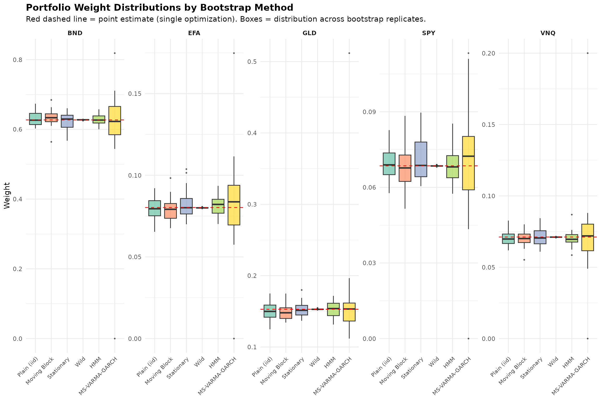

    ## 
    ## -----------------------------------------------------------------------
    ## INTERPRETATION
    ## -----------------------------------------------------------------------
    ## 
    ## Key observations:
    ## 
    ## 1. POINT vs BOOTSTRAP MEAN: The bootstrap-averaged weights generally differ
    ##    from the point estimate, sometimes substantially. This reflects estimation
    ##    uncertainty that the single-sample optimum ignores.
    ## 
    ## 2. METHOD AGREEMENT: If different bootstrap methods produce similar averaged
    ##    weights, this suggests the result is robust. Large disagreements indicate
    ##    sensitivity to assumptions about the data-generating process.
    ## 
    ## 3. UNCERTAINTY LEVELS: Simpler methods (Plain, Moving) often show different
    ##    uncertainty than model-based methods (HMM, MS-VARMA-GARCH). Neither is
    ##    'correct' - they reflect different assumptions about dependence structure.
    ## 
    ## 4. PRACTICAL GUIDANCE:
    ##    - For quick robustness checks: use Moving or Stationary block bootstrap
    ##    - For regime-aware analysis: use HMM or MS-VARMA-GARCH
    ##    - For heteroskedasticity: Wild bootstrap preserves variance patterns
    ##    - Report results from multiple methods when possible

### Runtime Benchmark

Different bootstrap methods have vastly different computational costs.
The simpler block-based methods are fast, while model-based methods
(HMM, MS-VARMA-GARCH) require fitting complex models and are
correspondingly slower.

The
[`benchmark_tsbs()`](https://mahovo.github.io/tsbs/reference/benchmark_tsbs.md)
utility allows systematic comparison of runtime across methods as we
vary parameters like the number of bootstrap replicates. This helps in
choosing an appropriate method given time constraints.

Note that the MS VARMA GARCH Bootstrap is very much slower than any of
the other bootstrap methods.

    ## -----------------------------------------------------------------------

    ## RUNTIME BENCHMARK

    ## -----------------------------------------------------------------------

``` r
## Define setups to benchmark (excluding slow MS-VARMA-GARCH for quick demo)
benchmark_setups <- list(
  "Plain (iid)" = list(bs_type = "moving", block_length = 1),
  "Moving Block" = list(bs_type = "moving", block_length = 5),
  "Stationary" = list(bs_type = "stationary"),
  "HMM" = list(bs_type = "hmm", num_states = 2),
  "Wild" = list(bs_type = "wild")
)

## Add HMM only for full analysis (it's moderately slow)
if (FULL_ANALYSIS) {
  ## Note: We don't pass 'func' - we're measuring bootstrap generation time only
  benchmark_setups[["MSGARCH"]] <-  list(
    bs_type = "ms_varma_garch", 
    model_type = "multivariate",
    num_states = 2,
    spec = spec_dcc,
    control = list(max_iter = 3)
  )
}

## Values to test: number of bootstrap replicates
#benchmark_values <- c(10, 25, 50)
benchmark_values <- 2^(3:9)
if (FULL_ANALYSIS) {
  benchmark_values <- 2^(2:5)
}

cat("Benchmarking", length(benchmark_setups), "methods across", 
    length(benchmark_values), "replicate counts...\n\n")
```

    ## Benchmarking 5 methods across 7 replicate counts...

``` r
## Run benchmark
bench_result <- tryCatch({
  benchmark_tsbs(
    x = y_compare,
    setups = benchmark_setups,
    vary = "num_boots",
    values = benchmark_values,
    times = 3,
    verbose = TRUE
  )
}, error = function(e) {
  message("Benchmark failed: ", e$message)
  NULL
})
```

    ## [1/105] Plain (iid): num_boots = 8 (rep 1/3)    [2/105] Plain (iid): num_boots = 8 (rep 2/3)    [3/105] Plain (iid): num_boots = 8 (rep 3/3)    [4/105] Plain (iid): num_boots = 16 (rep 1/3)    [5/105] Plain (iid): num_boots = 16 (rep 2/3)    [6/105] Plain (iid): num_boots = 16 (rep 3/3)    [7/105] Plain (iid): num_boots = 32 (rep 1/3)    [8/105] Plain (iid): num_boots = 32 (rep 2/3)    [9/105] Plain (iid): num_boots = 32 (rep 3/3)    [10/105] Plain (iid): num_boots = 64 (rep 1/3)    [11/105] Plain (iid): num_boots = 64 (rep 2/3)    [12/105] Plain (iid): num_boots = 64 (rep 3/3)    [13/105] Plain (iid): num_boots = 128 (rep 1/3)    [14/105] Plain (iid): num_boots = 128 (rep 2/3)    [15/105] Plain (iid): num_boots = 128 (rep 3/3)    [16/105] Plain (iid): num_boots = 256 (rep 1/3)    [17/105] Plain (iid): num_boots = 256 (rep 2/3)    [18/105] Plain (iid): num_boots = 256 (rep 3/3)    [19/105] Plain (iid): num_boots = 512 (rep 1/3)    [20/105] Plain (iid): num_boots = 512 (rep 2/3)    [21/105] Plain (iid): num_boots = 512 (rep 3/3)    [22/105] Moving Block: num_boots = 8 (rep 1/3)    [23/105] Moving Block: num_boots = 8 (rep 2/3)    [24/105] Moving Block: num_boots = 8 (rep 3/3)    [25/105] Moving Block: num_boots = 16 (rep 1/3)    [26/105] Moving Block: num_boots = 16 (rep 2/3)    [27/105] Moving Block: num_boots = 16 (rep 3/3)    [28/105] Moving Block: num_boots = 32 (rep 1/3)    [29/105] Moving Block: num_boots = 32 (rep 2/3)    [30/105] Moving Block: num_boots = 32 (rep 3/3)    [31/105] Moving Block: num_boots = 64 (rep 1/3)    [32/105] Moving Block: num_boots = 64 (rep 2/3)    [33/105] Moving Block: num_boots = 64 (rep 3/3)    [34/105] Moving Block: num_boots = 128 (rep 1/3)    [35/105] Moving Block: num_boots = 128 (rep 2/3)    [36/105] Moving Block: num_boots = 128 (rep 3/3)    [37/105] Moving Block: num_boots = 256 (rep 1/3)    [38/105] Moving Block: num_boots = 256 (rep 2/3)    [39/105] Moving Block: num_boots = 256 (rep 3/3)    [40/105] Moving Block: num_boots = 512 (rep 1/3)    [41/105] Moving Block: num_boots = 512 (rep 2/3)    [42/105] Moving Block: num_boots = 512 (rep 3/3)    [43/105] Stationary: num_boots = 8 (rep 1/3)    [44/105] Stationary: num_boots = 8 (rep 2/3)    [45/105] Stationary: num_boots = 8 (rep 3/3)    [46/105] Stationary: num_boots = 16 (rep 1/3)    [47/105] Stationary: num_boots = 16 (rep 2/3)    [48/105] Stationary: num_boots = 16 (rep 3/3)    [49/105] Stationary: num_boots = 32 (rep 1/3)    [50/105] Stationary: num_boots = 32 (rep 2/3)    [51/105] Stationary: num_boots = 32 (rep 3/3)    [52/105] Stationary: num_boots = 64 (rep 1/3)    [53/105] Stationary: num_boots = 64 (rep 2/3)    [54/105] Stationary: num_boots = 64 (rep 3/3)    [55/105] Stationary: num_boots = 128 (rep 1/3)    [56/105] Stationary: num_boots = 128 (rep 2/3)    [57/105] Stationary: num_boots = 128 (rep 3/3)    [58/105] Stationary: num_boots = 256 (rep 1/3)    [59/105] Stationary: num_boots = 256 (rep 2/3)    [60/105] Stationary: num_boots = 256 (rep 3/3)    [61/105] Stationary: num_boots = 512 (rep 1/3)    [62/105] Stationary: num_boots = 512 (rep 2/3)    [63/105] Stationary: num_boots = 512 (rep 3/3)    [64/105] HMM: num_boots = 8 (rep 1/3)    converged at iteration 32 with logLik: -1084.145 
    ## [65/105] HMM: num_boots = 8 (rep 2/3)    converged at iteration 33 with logLik: -1084.145 
    ## [66/105] HMM: num_boots = 8 (rep 3/3)    converged at iteration 33 with logLik: -1084.145 
    ## [67/105] HMM: num_boots = 16 (rep 1/3)    converged at iteration 36 with logLik: -1084.145 
    ## [68/105] HMM: num_boots = 16 (rep 2/3)    converged at iteration 35 with logLik: -1084.145 
    ## [69/105] HMM: num_boots = 16 (rep 3/3)    converged at iteration 35 with logLik: -1084.145 
    ## [70/105] HMM: num_boots = 32 (rep 1/3)    converged at iteration 35 with logLik: -1084.145 
    ## [71/105] HMM: num_boots = 32 (rep 2/3)    converged at iteration 36 with logLik: -1084.145 
    ## [72/105] HMM: num_boots = 32 (rep 3/3)    converged at iteration 34 with logLik: -1084.145 
    ## [73/105] HMM: num_boots = 64 (rep 1/3)    converged at iteration 33 with logLik: -1084.145 
    ## [74/105] HMM: num_boots = 64 (rep 2/3)    converged at iteration 33 with logLik: -1084.145 
    ## [75/105] HMM: num_boots = 64 (rep 3/3)    converged at iteration 32 with logLik: -1084.145 
    ## [76/105] HMM: num_boots = 128 (rep 1/3)    converged at iteration 35 with logLik: -1084.145 
    ## [77/105] HMM: num_boots = 128 (rep 2/3)    converged at iteration 23 with logLik: -1084.145 
    ## [78/105] HMM: num_boots = 128 (rep 3/3)    converged at iteration 33 with logLik: -1084.145 
    ## [79/105] HMM: num_boots = 256 (rep 1/3)    converged at iteration 33 with logLik: -1084.145 
    ## [80/105] HMM: num_boots = 256 (rep 2/3)    converged at iteration 34 with logLik: -1084.145 
    ## [81/105] HMM: num_boots = 256 (rep 3/3)    converged at iteration 28 with logLik: -1084.145 
    ## [82/105] HMM: num_boots = 512 (rep 1/3)    converged at iteration 32 with logLik: -1084.145 
    ## [83/105] HMM: num_boots = 512 (rep 2/3)    converged at iteration 29 with logLik: -1084.145 
    ## [84/105] HMM: num_boots = 512 (rep 3/3)    converged at iteration 33 with logLik: -1084.145 
    ## [85/105] Wild: num_boots = 8 (rep 1/3)    [86/105] Wild: num_boots = 8 (rep 2/3)    [87/105] Wild: num_boots = 8 (rep 3/3)    [88/105] Wild: num_boots = 16 (rep 1/3)    [89/105] Wild: num_boots = 16 (rep 2/3)    [90/105] Wild: num_boots = 16 (rep 3/3)    [91/105] Wild: num_boots = 32 (rep 1/3)    [92/105] Wild: num_boots = 32 (rep 2/3)    [93/105] Wild: num_boots = 32 (rep 3/3)    [94/105] Wild: num_boots = 64 (rep 1/3)    [95/105] Wild: num_boots = 64 (rep 2/3)    [96/105] Wild: num_boots = 64 (rep 3/3)    [97/105] Wild: num_boots = 128 (rep 1/3)    [98/105] Wild: num_boots = 128 (rep 2/3)    [99/105] Wild: num_boots = 128 (rep 3/3)    [100/105] Wild: num_boots = 256 (rep 1/3)    [101/105] Wild: num_boots = 256 (rep 2/3)    [102/105] Wild: num_boots = 256 (rep 3/3)    [103/105] Wild: num_boots = 512 (rep 1/3)    [104/105] Wild: num_boots = 512 (rep 2/3)    [105/105] Wild: num_boots = 512 (rep 3/3)

``` r
## Display results
if (!is.null(bench_result)) {
  cat("\n")
  print(bench_result)
  
  ## Plot
  plot(bench_result, show_ribbon = FALSE, show_points = TRUE)
}
```

    ## 
    ## tsbs Benchmark Results
    ## ======================
    ## 
    ## Varying parameter: num_boots 
    ## Values tested: 8, 16, 32, 64, 128, 256, 512 
    ## Repetitions per test: 3 
    ## Input data dimensions: 252 x 5 
    ## 
    ## Setups compared:
    ##   - Plain (iid) : bs_type = moving, block_length = 1
    ##   - Moving Block : bs_type = moving, block_length = 5
    ##   - Stationary : bs_type = stationary
    ##   - HMM : bs_type = hmm
    ##   - Wild : bs_type = wild
    ## 
    ## Mean runtime (seconds) by setup and num_boots :
    ## 
    ##  Value   HMM Moving Block Plain (iid) Stationary    Wild
    ##      8 0.148      0.00104    0.000882   0.000809 0.00361
    ##     16 0.133      0.00140    0.001412   0.001222 0.00505
    ##     32 0.141      0.08305    0.002383   0.003679 0.00790
    ##     64 0.152      0.00372    0.004312   0.003910 0.01359
    ##    128 0.195      0.00696    0.007568   0.012244 0.02817
    ##    256 0.286      0.01527    0.021098   0.016304 0.05157
    ##    512 0.479      0.03045    0.044552   0.032129 0.17237

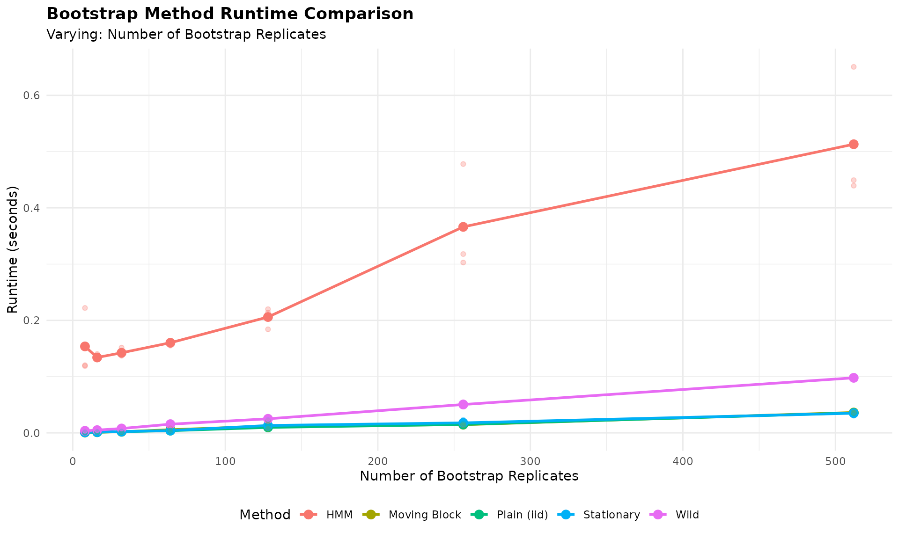

``` r
## Define setups to benchmark (excluding slow MS-VARMA-GARCH for quick demo)
benchmark_setups <- list(
  "Plain (iid)" = list(bs_type = "moving", block_length = 1),
  "Moving Block" = list(bs_type = "moving", block_length = 5),
  "Stationary" = list(bs_type = "stationary"),
  "HMM" = list(bs_type = "hmm", num_states = 2),
  "Wild" = list(bs_type = "wild")
)

## Add HMM only for full analysis (it's moderately slow)
if (FULL_ANALYSIS) {
  ## Note: We don't pass 'func' - we're measuring bootstrap generation time only
  benchmark_setups[["MSGARCH"]] <-  list(
    bs_type = "ms_varma_garch", 
    model_type = "multivariate",
    num_states = 2,
    spec = spec_dcc,
    control = list(max_iter = 3)
  )
}

## Values to test: number of bootstrap replicates
#benchmark_values <- c(10, 25, 50)
benchmark_values <- 2^(6:10)
if (FULL_ANALYSIS) {
  benchmark_values <- 2^(6:9)
}

cat("Benchmarking", length(benchmark_setups), "methods across", 
    length(benchmark_values), "replicate counts...\n\n")
```

    ## Benchmarking 5 methods across 5 replicate counts...

``` r
## Run benchmark
bench_result <- tryCatch({
  benchmark_tsbs(
    x = y_compare,
    setups = benchmark_setups,
    vary = "n_boot",
    values = benchmark_values,
    times = 3,
    verbose = TRUE
  )
}, error = function(e) {
  message("Benchmark failed: ", e$message)
  NULL
})
```

    ## [1/75] Plain (iid): n_boot = 64 (rep 1/3)    [2/75] Plain (iid): n_boot = 64 (rep 2/3)    [3/75] Plain (iid): n_boot = 64 (rep 3/3)    [4/75] Plain (iid): n_boot = 128 (rep 1/3)    [5/75] Plain (iid): n_boot = 128 (rep 2/3)    [6/75] Plain (iid): n_boot = 128 (rep 3/3)    [7/75] Plain (iid): n_boot = 256 (rep 1/3)    [8/75] Plain (iid): n_boot = 256 (rep 2/3)    [9/75] Plain (iid): n_boot = 256 (rep 3/3)    [10/75] Plain (iid): n_boot = 512 (rep 1/3)    [11/75] Plain (iid): n_boot = 512 (rep 2/3)    [12/75] Plain (iid): n_boot = 512 (rep 3/3)    [13/75] Plain (iid): n_boot = 1024 (rep 1/3)    [14/75] Plain (iid): n_boot = 1024 (rep 2/3)    [15/75] Plain (iid): n_boot = 1024 (rep 3/3)    [16/75] Moving Block: n_boot = 64 (rep 1/3)    [17/75] Moving Block: n_boot = 64 (rep 2/3)    [18/75] Moving Block: n_boot = 64 (rep 3/3)    [19/75] Moving Block: n_boot = 128 (rep 1/3)    [20/75] Moving Block: n_boot = 128 (rep 2/3)    [21/75] Moving Block: n_boot = 128 (rep 3/3)    [22/75] Moving Block: n_boot = 256 (rep 1/3)    [23/75] Moving Block: n_boot = 256 (rep 2/3)    [24/75] Moving Block: n_boot = 256 (rep 3/3)    [25/75] Moving Block: n_boot = 512 (rep 1/3)    [26/75] Moving Block: n_boot = 512 (rep 2/3)    [27/75] Moving Block: n_boot = 512 (rep 3/3)    [28/75] Moving Block: n_boot = 1024 (rep 1/3)    [29/75] Moving Block: n_boot = 1024 (rep 2/3)    [30/75] Moving Block: n_boot = 1024 (rep 3/3)    [31/75] Stationary: n_boot = 64 (rep 1/3)    [32/75] Stationary: n_boot = 64 (rep 2/3)    [33/75] Stationary: n_boot = 64 (rep 3/3)    [34/75] Stationary: n_boot = 128 (rep 1/3)    [35/75] Stationary: n_boot = 128 (rep 2/3)    [36/75] Stationary: n_boot = 128 (rep 3/3)    [37/75] Stationary: n_boot = 256 (rep 1/3)    [38/75] Stationary: n_boot = 256 (rep 2/3)    [39/75] Stationary: n_boot = 256 (rep 3/3)    [40/75] Stationary: n_boot = 512 (rep 1/3)    [41/75] Stationary: n_boot = 512 (rep 2/3)    [42/75] Stationary: n_boot = 512 (rep 3/3)    [43/75] Stationary: n_boot = 1024 (rep 1/3)    [44/75] Stationary: n_boot = 1024 (rep 2/3)    [45/75] Stationary: n_boot = 1024 (rep 3/3)    [46/75] HMM: n_boot = 64 (rep 1/3)    converged at iteration 34 with logLik: -1084.145 
    ## [47/75] HMM: n_boot = 64 (rep 2/3)    converged at iteration 29 with logLik: -1084.145 
    ## [48/75] HMM: n_boot = 64 (rep 3/3)    converged at iteration 34 with logLik: -1084.145 
    ## [49/75] HMM: n_boot = 128 (rep 1/3)    converged at iteration 35 with logLik: -1084.145 
    ## [50/75] HMM: n_boot = 128 (rep 2/3)    converged at iteration 35 with logLik: -1084.145 
    ## [51/75] HMM: n_boot = 128 (rep 3/3)    converged at iteration 33 with logLik: -1084.145 
    ## [52/75] HMM: n_boot = 256 (rep 1/3)    converged at iteration 32 with logLik: -1084.145 
    ## [53/75] HMM: n_boot = 256 (rep 2/3)    converged at iteration 36 with logLik: -1084.145 
    ## [54/75] HMM: n_boot = 256 (rep 3/3)    converged at iteration 35 with logLik: -1084.145 
    ## [55/75] HMM: n_boot = 512 (rep 1/3)    converged at iteration 34 with logLik: -1084.145 
    ## [56/75] HMM: n_boot = 512 (rep 2/3)    converged at iteration 34 with logLik: -1084.145 
    ## [57/75] HMM: n_boot = 512 (rep 3/3)    converged at iteration 33 with logLik: -1084.145 
    ## [58/75] HMM: n_boot = 1024 (rep 1/3)    converged at iteration 33 with logLik: -1084.145 
    ## [59/75] HMM: n_boot = 1024 (rep 2/3)    converged at iteration 26 with logLik: -1084.145 
    ## [60/75] HMM: n_boot = 1024 (rep 3/3)    converged at iteration 34 with logLik: -1084.145 
    ## [61/75] Wild: n_boot = 64 (rep 1/3)    [62/75] Wild: n_boot = 64 (rep 2/3)    [63/75] Wild: n_boot = 64 (rep 3/3)    [64/75] Wild: n_boot = 128 (rep 1/3)    [65/75] Wild: n_boot = 128 (rep 2/3)    [66/75] Wild: n_boot = 128 (rep 3/3)    [67/75] Wild: n_boot = 256 (rep 1/3)    [68/75] Wild: n_boot = 256 (rep 2/3)    [69/75] Wild: n_boot = 256 (rep 3/3)    [70/75] Wild: n_boot = 512 (rep 1/3)    [71/75] Wild: n_boot = 512 (rep 2/3)    [72/75] Wild: n_boot = 512 (rep 3/3)    [73/75] Wild: n_boot = 1024 (rep 1/3)    [74/75] Wild: n_boot = 1024 (rep 2/3)    [75/75] Wild: n_boot = 1024 (rep 3/3)

``` r
## Display results
if (!is.null(bench_result)) {
  cat("\n")
  print(bench_result)
  
  ## Plot
  plot(bench_result, show_ribbon = FALSE, show_points = TRUE)
}
```

    ## 
    ## tsbs Benchmark Results
    ## ======================
    ## 
    ## Varying parameter: n_boot 
    ## Values tested: 64, 128, 256, 512, 1024 
    ## Repetitions per test: 3 
    ## Input data dimensions: 252 x 5 
    ## 
    ## Setups compared:
    ##   - Plain (iid) : bs_type = moving, block_length = 1
    ##   - Moving Block : bs_type = moving, block_length = 5
    ##   - Stationary : bs_type = stationary
    ##   - HMM : bs_type = hmm
    ##   - Wild : bs_type = wild
    ## 
    ## Mean runtime (seconds) by setup and n_boot :
    ## 
    ##  Value   HMM Moving Block Plain (iid) Stationary   Wild
    ##     64 0.129      0.00453     0.00480    0.00468 0.0205
    ##    128 0.147      0.00497     0.00514    0.00508 0.0227
    ##    256 0.184      0.00570     0.00597    0.00759 0.0203
    ##    512 0.258      0.00906     0.00972    0.01390 0.0204
    ##   1024 0.463      0.01322     0.01238    0.01309 0.0232

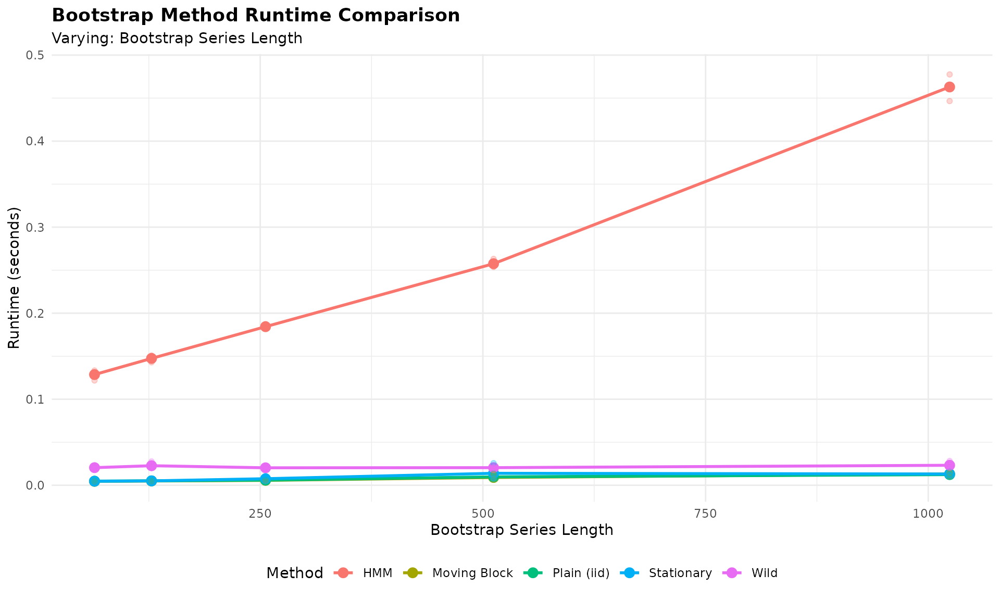

``` r
## Define setups to benchmark (excluding slow MS-VARMA-GARCH for quick demo)
benchmark_setups <- list(
  "Plain (iid)" = list(bs_type = "moving", block_length = 1),
  "Moving Block" = list(bs_type = "moving", block_length = 5),
  "Stationary" = list(bs_type = "stationary"),
  "HMM" = list(bs_type = "hmm", num_states = 2),
  "Wild" = list(bs_type = "wild")
)

## Add HMM only for full analysis (it's moderately slow)
if (FULL_ANALYSIS) {
  ## Note: We don't pass 'func' - we're measuring bootstrap generation time only
  benchmark_setups[["MSGARCH"]] <-  list(
    bs_type = "ms_varma_garch", 
    model_type = "multivariate",
    num_states = 2,
    spec = spec_dcc,
    control = list(max_iter = 3)
  )
}

## Values to test: number of bootstrap replicates
#benchmark_values <- c(10, 25, 50)
benchmark_values <- 2^(2:7)
if (FULL_ANALYSIS) {
  benchmark_values <- 2^(2:7)
}

cat("Benchmarking", length(benchmark_setups), "methods across", 
    length(benchmark_values), "replicate counts...\n\n")
```

    ## Benchmarking 5 methods across 6 replicate counts...

``` r
## Run benchmark
bench_result <- tryCatch({
  benchmark_tsbs(
    x = matrix(rnorm((2^7) * 252), nrow = 252),#y_compare,
    setups = benchmark_setups,
    vary = "n_assets",
    values = benchmark_values,
    times = 3,
    verbose = TRUE
  )
}, error = function(e) {
  message("Benchmark failed: ", e$message)
  NULL
})
```

    ## [1/90] Plain (iid): n_assets = 4 (rep 1/3)    [2/90] Plain (iid): n_assets = 4 (rep 2/3)    [3/90] Plain (iid): n_assets = 4 (rep 3/3)    [4/90] Plain (iid): n_assets = 8 (rep 1/3)    [5/90] Plain (iid): n_assets = 8 (rep 2/3)    [6/90] Plain (iid): n_assets = 8 (rep 3/3)    [7/90] Plain (iid): n_assets = 16 (rep 1/3)    [8/90] Plain (iid): n_assets = 16 (rep 2/3)    [9/90] Plain (iid): n_assets = 16 (rep 3/3)    [10/90] Plain (iid): n_assets = 32 (rep 1/3)    [11/90] Plain (iid): n_assets = 32 (rep 2/3)    [12/90] Plain (iid): n_assets = 32 (rep 3/3)    [13/90] Plain (iid): n_assets = 64 (rep 1/3)    [14/90] Plain (iid): n_assets = 64 (rep 2/3)    [15/90] Plain (iid): n_assets = 64 (rep 3/3)    [16/90] Plain (iid): n_assets = 128 (rep 1/3)    [17/90] Plain (iid): n_assets = 128 (rep 2/3)    [18/90] Plain (iid): n_assets = 128 (rep 3/3)    [19/90] Moving Block: n_assets = 4 (rep 1/3)    [20/90] Moving Block: n_assets = 4 (rep 2/3)    [21/90] Moving Block: n_assets = 4 (rep 3/3)    [22/90] Moving Block: n_assets = 8 (rep 1/3)    [23/90] Moving Block: n_assets = 8 (rep 2/3)    [24/90] Moving Block: n_assets = 8 (rep 3/3)    [25/90] Moving Block: n_assets = 16 (rep 1/3)    [26/90] Moving Block: n_assets = 16 (rep 2/3)    [27/90] Moving Block: n_assets = 16 (rep 3/3)    [28/90] Moving Block: n_assets = 32 (rep 1/3)    [29/90] Moving Block: n_assets = 32 (rep 2/3)    [30/90] Moving Block: n_assets = 32 (rep 3/3)    [31/90] Moving Block: n_assets = 64 (rep 1/3)    [32/90] Moving Block: n_assets = 64 (rep 2/3)    [33/90] Moving Block: n_assets = 64 (rep 3/3)    [34/90] Moving Block: n_assets = 128 (rep 1/3)    [35/90] Moving Block: n_assets = 128 (rep 2/3)    [36/90] Moving Block: n_assets = 128 (rep 3/3)    [37/90] Stationary: n_assets = 4 (rep 1/3)    [38/90] Stationary: n_assets = 4 (rep 2/3)    [39/90] Stationary: n_assets = 4 (rep 3/3)    [40/90] Stationary: n_assets = 8 (rep 1/3)    [41/90] Stationary: n_assets = 8 (rep 2/3)    [42/90] Stationary: n_assets = 8 (rep 3/3)    [43/90] Stationary: n_assets = 16 (rep 1/3)    [44/90] Stationary: n_assets = 16 (rep 2/3)    [45/90] Stationary: n_assets = 16 (rep 3/3)    [46/90] Stationary: n_assets = 32 (rep 1/3)    [47/90] Stationary: n_assets = 32 (rep 2/3)    [48/90] Stationary: n_assets = 32 (rep 3/3)    [49/90] Stationary: n_assets = 64 (rep 1/3)    [50/90] Stationary: n_assets = 64 (rep 2/3)    [51/90] Stationary: n_assets = 64 (rep 3/3)    [52/90] Stationary: n_assets = 128 (rep 1/3)    [53/90] Stationary: n_assets = 128 (rep 2/3)    [54/90] Stationary: n_assets = 128 (rep 3/3)    [55/90] HMM: n_assets = 4 (rep 1/3)    converged at iteration 126 with logLik: -1457.335 
    ## [56/90] HMM: n_assets = 4 (rep 2/3)    converged at iteration 116 with logLik: -1457.335 
    ## [57/90] HMM: n_assets = 4 (rep 3/3)    converged at iteration 139 with logLik: -1457.335 
    ## [58/90] HMM: n_assets = 8 (rep 1/3)    converged at iteration 147 with logLik: -2867.839 
    ## [59/90] HMM: n_assets = 8 (rep 2/3)    converged at iteration 124 with logLik: -2867.429 
    ## [60/90] HMM: n_assets = 8 (rep 3/3)    converged at iteration 133 with logLik: -2867.429 
    ## [61/90] HMM: n_assets = 16 (rep 1/3)    converged at iteration 78 with logLik: -5693.949 
    ## [62/90] HMM: n_assets = 16 (rep 2/3)    converged at iteration 164 with logLik: -5702.279 
    ## [63/90] HMM: n_assets = 16 (rep 3/3)    converged at iteration 75 with logLik: -5693.949 
    ## [64/90] HMM: n_assets = 32 (rep 1/3)    converged at iteration 197 with logLik: -11405.85 
    ## [65/90] HMM: n_assets = 32 (rep 2/3)    converged at iteration 60 with logLik: -11399.32 
    ## [66/90] HMM: n_assets = 32 (rep 3/3)    converged at iteration 135 with logLik: -11405.85 
    ## [67/90] HMM: n_assets = 64 (rep 1/3)    converged at iteration 79 with logLik: -22775.09 
    ## [68/90] HMM: n_assets = 64 (rep 2/3)    converged at iteration 37 with logLik: -22770.01 
    ## [69/90] HMM: n_assets = 64 (rep 3/3)    converged at iteration 112 with logLik: -22770.01 
    ## [70/90] HMM: n_assets = 128 (rep 1/3)    converged at iteration 83 with logLik: -45462.6 
    ## [71/90] HMM: n_assets = 128 (rep 2/3)    converged at iteration 55 with logLik: -45462.55 
    ## [72/90] HMM: n_assets = 128 (rep 3/3)    converged at iteration 165 with logLik: -45478.75 
    ## [73/90] Wild: n_assets = 4 (rep 1/3)    [74/90] Wild: n_assets = 4 (rep 2/3)    [75/90] Wild: n_assets = 4 (rep 3/3)    [76/90] Wild: n_assets = 8 (rep 1/3)    [77/90] Wild: n_assets = 8 (rep 2/3)    [78/90] Wild: n_assets = 8 (rep 3/3)    [79/90] Wild: n_assets = 16 (rep 1/3)    [80/90] Wild: n_assets = 16 (rep 2/3)    [81/90] Wild: n_assets = 16 (rep 3/3)    [82/90] Wild: n_assets = 32 (rep 1/3)    [83/90] Wild: n_assets = 32 (rep 2/3)    [84/90] Wild: n_assets = 32 (rep 3/3)    [85/90] Wild: n_assets = 64 (rep 1/3)    [86/90] Wild: n_assets = 64 (rep 2/3)    [87/90] Wild: n_assets = 64 (rep 3/3)    [88/90] Wild: n_assets = 128 (rep 1/3)    [89/90] Wild: n_assets = 128 (rep 2/3)    [90/90] Wild: n_assets = 128 (rep 3/3)

``` r
## Display results
if (!is.null(bench_result)) {
  cat("\n")
  print(bench_result)
  
  ## Plot
  plot(bench_result, show_ribbon = FALSE, show_points = TRUE)
}
```

    ## 
    ## tsbs Benchmark Results
    ## ======================
    ## 
    ## Varying parameter: n_assets 
    ## Values tested: 4, 8, 16, 32, 64, 128 
    ## Repetitions per test: 3 
    ## Input data dimensions: 252 x 128 
    ## 
    ## Setups compared:
    ##   - Plain (iid) : bs_type = moving, block_length = 1
    ##   - Moving Block : bs_type = moving, block_length = 5
    ##   - Stationary : bs_type = stationary
    ##   - HMM : bs_type = hmm
    ##   - Wild : bs_type = wild
    ## 
    ## Mean runtime (seconds) by setup and n_assets :
    ## 
    ##  Value   HMM Moving Block Plain (iid) Stationary   Wild
    ##      4 0.344      0.00490     0.00779    0.00526 0.0195
    ##      8 0.764      0.00937     0.00803    0.00977 0.0222
    ##     16 0.921      0.01498     0.01779    0.01531 0.0281
    ##     32 1.959      0.02805     0.03409    0.10052 0.0415
    ##     64 2.294      0.12595     0.12711    0.05116 0.0676
    ##    128 6.037      0.10349     0.18502    0.17778 0.1925

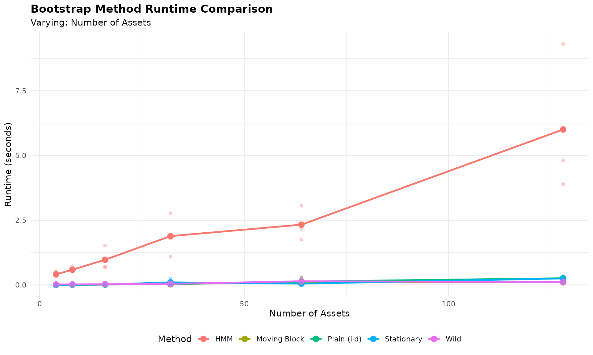

    ## 
    ## -----------------------------------------------------------------------
    ## BENCHMARK INTERPRETATION
    ## -----------------------------------------------------------------------
    ## 
    ## Key takeaways:
    ## 
    ## 1. BLOCK METHODS ARE FAST: Plain, Moving Block, and Stationary bootstrap
    ##    have nearly identical runtime - the block structure adds minimal overhead.
    ## 
    ## 2. WILD BOOTSTRAP: Also very fast since it only multiplies by random signs.
    ## 
    ## 3. LINEAR SCALING: All methods scale roughly linearly with num_boots,
    ##    making it easy to estimate runtime for larger analyses.
    ## 
    ## 4. HMM/MS-VARMA-GARCH: Much slower due to model fitting. Use these when
    ## 
    ##    regime dynamics are important, but be aware of the computational cost.
    ## 
    ## 5. PRACTICAL TIP: For exploratory analysis, start with fast methods.
    ##    Switch to model-based methods for final results when regime structure matters.

### Visualizing Bootstrap Composition

To understand how different bootstrap methods sample from the original
data, we use
[`plot_regime_composition()`](https://mahovo.github.io/tsbs/reference/plot_regime_composition.md)
from the diagnostics system. For regime-switching methods (HMM,
MS-VARMA-GARCH), we can overlay smoothed state probabilities to show
regime uncertainty.

    ## -----------------------------------------------------------------------

    ## BOOTSTRAP COMPOSITION VISUALIZATION

    ## -----------------------------------------------------------------------

``` r
## Run bootstrap methods with diagnostics enabled for visualization
## Using a single replicate for clarity

set.seed(123)
num_boots_viz <- 3  # Small number for visualization

## Helper to create regime bands from rolling volatility
create_vol_regimes <- function(x, window = 21) {
  vol <- zoo::rollapply(x[, 1], width = window, FUN = sd, fill = NA, align = "right")
  vol_median <- median(vol, na.rm = TRUE)
  regimes <- ifelse(vol > vol_median, 2, 1)
  regimes[is.na(regimes)] <- 1
  regimes
}

## Create regime bands data frame for plotting
create_regime_bands <- function(regimes, label) {
  rle_reg <- rle(regimes)
  ends <- cumsum(rle_reg$lengths)
  starts <- c(1, head(ends, -1) + 1)
  data.frame(
    xmin = starts,
    xmax = ends,
    Regime = ifelse(rle_reg$values == 1, "Low Volatility", "High Volatility"),
    Series = label,
    stringsAsFactors = FALSE
  )
}

## Compute regimes for original data
orig_regimes <- create_vol_regimes(y_compare)

## Compute cumulative returns for visualization
cum_returns <- function(r) {
  100 * exp(cumsum(r[, 1] / 100))
}

## Storage for plot data
plot_data_list <- list()
regime_bands_list <- list()

## Original series
plot_data_list[["Original"]] <- data.frame(
  Index = seq_len(nrow(y_compare)),
  Value = cum_returns(y_compare),
  Series = "Original"
)
regime_bands_list[["Original"]] <- create_regime_bands(orig_regimes, "Original")

## --- Moving Block Bootstrap ---
cat("Generating Moving Block visualization...\n")
```

    ## Generating Moving Block visualization...

``` r
moving_viz <- tsbs(x = y_compare, bs_type = "moving", block_length = 10, num_boots = 1)

boot_series <- moving_viz$bootstrap_series[[1]]
plot_data_list[["Moving Block"]] <- data.frame(
  Index = seq_len(nrow(boot_series)),
  Value = cum_returns(boot_series),
  Series = "Moving Block"
)
## For block methods, we don't have regime info - use proxy
boot_regimes <- create_vol_regimes(boot_series)
regime_bands_list[["Moving Block"]] <- create_regime_bands(boot_regimes, "Moving Block")

## --- Stationary Bootstrap ---
cat("Generating Stationary Block visualization...\n")
```

    ## Generating Stationary Block visualization...

``` r
stat_viz <- tsbs(x = y_compare, bs_type = "stationary", num_boots = 1)

boot_series <- stat_viz$bootstrap_series[[1]]
plot_data_list[["Stationary"]] <- data.frame(
  Index = seq_len(nrow(boot_series)),
  Value = cum_returns(boot_series),
  Series = "Stationary"
)
boot_regimes <- create_vol_regimes(boot_series)
regime_bands_list[["Stationary"]] <- create_regime_bands(boot_regimes, "Stationary")

## --- HMM Bootstrap (with actual fitted regimes) ---
cat("Generating HMM visualization...\n")
```

    ## Generating HMM visualization...

``` r
hmm_viz <- tryCatch({
  tsbs(x = y_compare, bs_type = "hmm", num_states = 2, num_boots = 1, return_fit = TRUE)
}, error = function(e) NULL)
```

    ## converged at iteration 33 with logLik: -1084.145

``` r
if (!is.null(hmm_viz)) {
  boot_series <- hmm_viz$bootstrap_series[[1]]
  plot_data_list[["HMM"]] <- data.frame(
    Index = seq_len(nrow(boot_series)),
    Value = cum_returns(boot_series),
    Series = "HMM"
  )
  
  ## Use actual fitted states if available
  if (!is.null(hmm_viz$fit)) {
    fitted_states <- tryCatch({
      depmixS4::posterior(hmm_viz$fit, type = "viterbi")$state
    }, error = function(e) create_vol_regimes(boot_series))
  } else {
    fitted_states <- create_vol_regimes(boot_series)
  }
  regime_bands_list[["HMM"]] <- create_regime_bands(fitted_states, "HMM")
}

## --- Wild Bootstrap ---
cat("Generating Wild Bootstrap visualization...\n")
```

    ## Generating Wild Bootstrap visualization...

``` r
wild_viz <- tsbs(x = y_compare, bs_type = "wild", num_boots = 1)

boot_series <- wild_viz$bootstrap_series[[1]]
plot_data_list[["Wild"]] <- data.frame(
  Index = seq_len(nrow(boot_series)),
  Value = cum_returns(boot_series),
  Series = "Wild"
)
boot_regimes <- create_vol_regimes(boot_series)
regime_bands_list[["Wild"]] <- create_regime_bands(boot_regimes, "Wild")

## Combine all data
plot_df <- do.call(rbind, plot_data_list)
regime_df <- do.call(rbind, regime_bands_list)

## Set factor order
series_order <- c("Original", "Moving Block", "Stationary", "HMM", "Wild")
plot_df$Series <- factor(plot_df$Series, levels = series_order)
regime_df$Series <- factor(regime_df$Series, levels = series_order)

## Create the plot
library(ggplot2)

p_composition <- ggplot() +
  ## Regime bands
  geom_rect(data = regime_df,
            aes(xmin = xmin, xmax = xmax, ymin = -Inf, ymax = Inf, fill = Regime),
            alpha = 0.3) +
  ## Price lines
  geom_line(data = plot_df,
            aes(x = Index, y = Value),
            color = "black", linewidth = 0.4) +
  ## Facet
  facet_wrap(~ Series, ncol = 1, scales = "free_y") +
  ## Colors
  scale_fill_manual(values = c("Low Volatility" = "lightblue", 
                                "High Volatility" = "salmon")) +
  ## Labels
  labs(title = "Bootstrap Composition: Original vs. Resampled Series",
       subtitle = "Colored bands show volatility regimes (estimated from rolling volatility)",
       x = "Time Index",
       y = "Cumulative Value (%)") +
  theme_minimal() +
  theme(
    legend.position = "bottom",
    strip.text = element_text(face = "bold", size = 10),
    plot.title = element_text(face = "bold")
  )

print(p_composition)
```

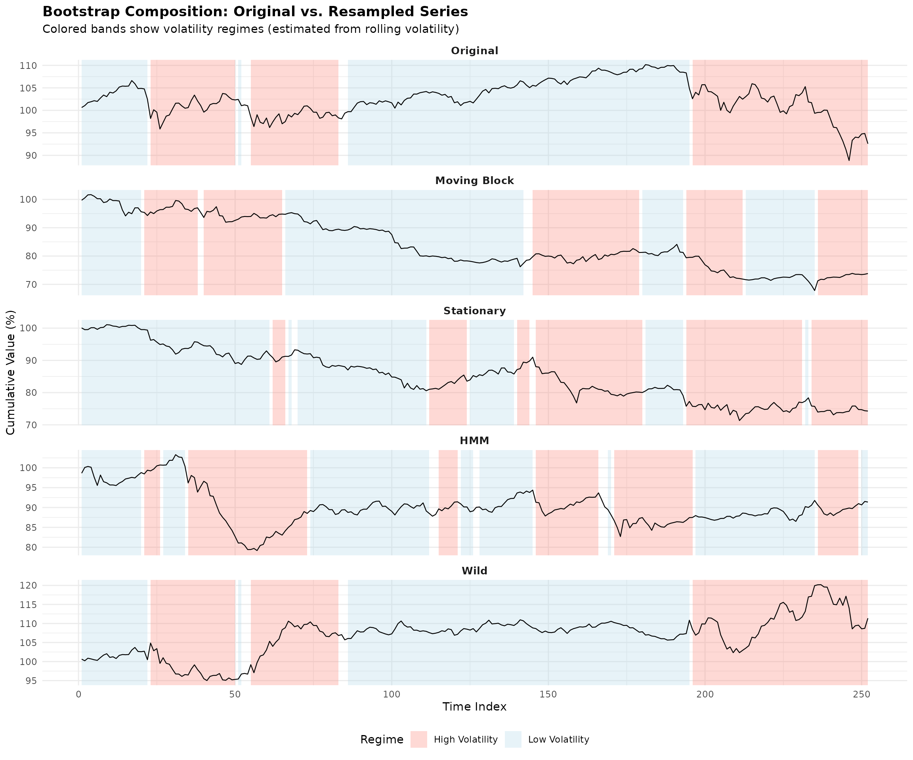

    ## --- Interpretation ---

    ## The plot above shows how different bootstrap methods resample the original series:

    ## - ORIGINAL: The actual return series with volatility-based regime classification

    ## - MOVING BLOCK: Resamples contiguous 10-day blocks, preserving local structure

    ##   but potentially creating artificial regime transitions at block boundaries

    ## - STATIONARY: Similar to moving block but with random (geometric) block lengths,

    ##   providing some variability in the dependence structure captured

    ## - HMM: Uses fitted Hidden Markov Model to identify regimes, then resamples

    ##   entire regime blocks. This preserves within-regime dynamics better.

    ## - WILD: Multiplies each observation by +1 or -1, preserving magnitude structure

    ##   but randomizing signs. Note: regime patterns still visible from magnitudes.

    ## Key insight: Regime-based methods (HMM, MS-VARMA-GARCH) are designed to preserve

    ## the regime structure, while block methods may inadvertently mix observations

    ## from different regimes.

## Conclusion

This vignette demonstrated:

1.  **Multi-model comparison**: DCC, CGARCH, and GOGARCH each provide
    different perspectives on correlation dynamics and portfolio
    uncertainty.

2.  **Bootstrap diagnostics system**: The `tsbs` package’s
    `tsbs_diagnostics` class provides comprehensive tools for analyzing
    bootstrap quality:

    - [`compute_bootstrap_diagnostics()`](https://mahovo.github.io/tsbs/reference/compute_bootstrap_diagnostics.md)
      for post-hoc analysis
    - [`summary()`](https://rdrr.io/r/base/summary.html) and
      [`plot()`](https://rdrr.io/r/graphics/plot.default.html) methods
      for visualization
    - [`extract_blocks()`](https://mahovo.github.io/tsbs/reference/extract_blocks.md)
      and
      [`extract_summary_stats()`](https://mahovo.github.io/tsbs/reference/extract_summary_stats.md)
      for programmatic access

3.  **Practical portfolio optimization**: Six strategies were compared
    using real market data with quarterly rebalancing.

4.  **Uncertainty quantification**: Bootstrap methods reveal substantial
    uncertainty in optimal weights, which should inform allocation
    decisions.

5.  **Bootstrap method comparison**: Different bootstrap approaches
    produce different uncertainty estimates:

    - Block methods (moving, stationary) are fast but may mix regimes
    - Regime methods (HMM, MS-VARMA-GARCH) preserve dynamics at higher
      cost
    - Wild bootstrap handles heteroskedasticity

6.  **Composition visualization**:
    [`plot_regime_composition()`](https://mahovo.github.io/tsbs/reference/plot_regime_composition.md)
    reveals how each method samples from the original data, helping
    users understand the implications of their method choice.

7.  **Runtime considerations**: The
    [`benchmark_tsbs()`](https://mahovo.github.io/tsbs/reference/benchmark_tsbs.md)
    utility helps choose methods based on computational constraints.

For more details on the underlying models, see: -
[`?tsbs`](https://mahovo.github.io/tsbs/reference/tsbs.md) for the main
bootstrap interface -
[`?compute_bootstrap_diagnostics`](https://mahovo.github.io/tsbs/reference/compute_bootstrap_diagnostics.md)
for the diagnostics system -
[`?plot.tsbs_diagnostics`](https://mahovo.github.io/tsbs/reference/plot.tsbs_diagnostics.md)
for diagnostic visualization -
[`?extract_blocks`](https://mahovo.github.io/tsbs/reference/extract_blocks.md)
and
[`?extract_summary_stats`](https://mahovo.github.io/tsbs/reference/extract_summary_stats.md)
for data extraction -
[`?benchmark_tsbs`](https://mahovo.github.io/tsbs/reference/benchmark_tsbs.md)
for runtime benchmarking

    ## =======================================================================

    ## SESSION INFO

    ## =======================================================================

    ## 
    ## Vignette completed at: 2026-01-28 14:52:19

    ## R version: R version 4.5.2 (2025-10-31)
