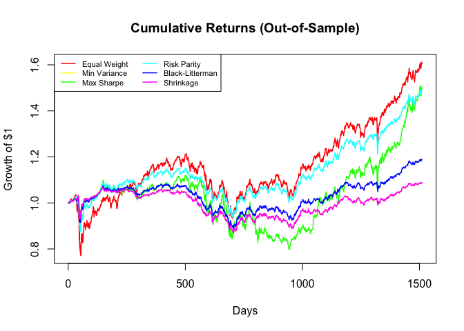
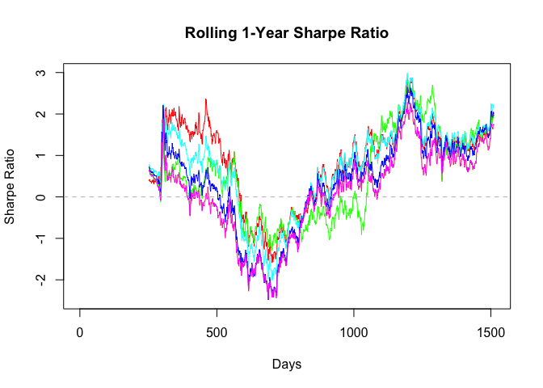
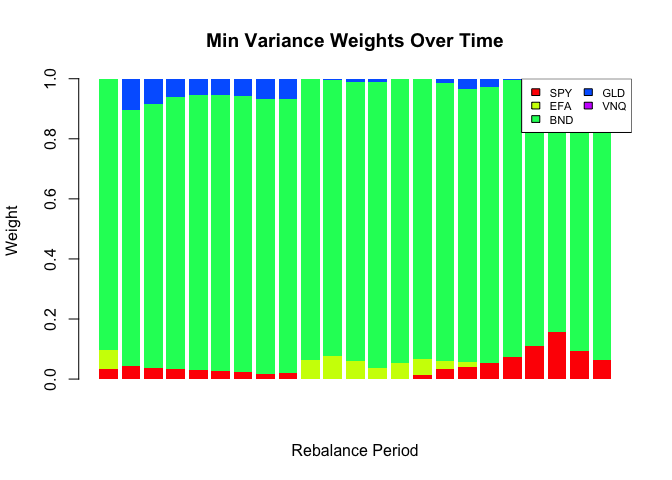
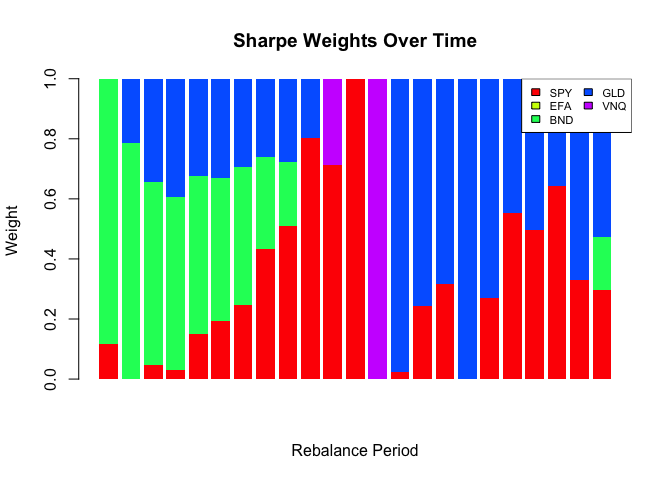
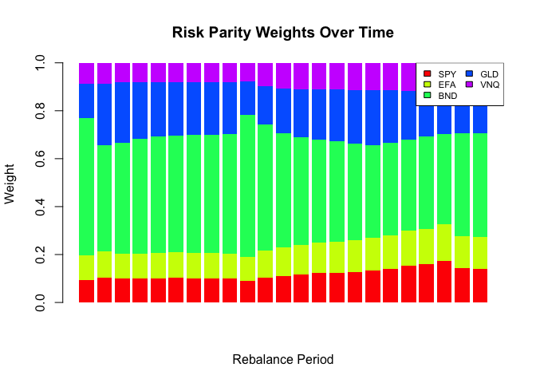
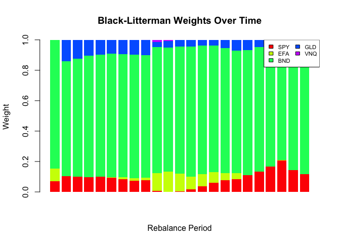
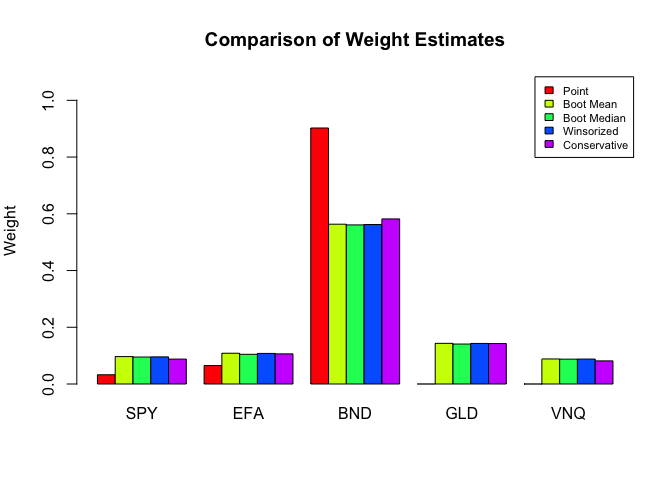

## tsbs: Advanced Portfolio Optimization with DCC-GARCH Bootstrap

This demo demonstrates:  
1. Six portfolio optimization strategies:  
  - Equal Weight (benchmark)  
  - Minimum Variance  
  - Maximum Sharpe Ratio  
  - Risk Parity  
  - Black-Litterman\  
  - Shrinkage (Ledoit-Wolf)  
2. Real market data  
3. Out-of-sample backtesting with quarterly rebalancing  
4. Bootstrap uncertainty quantification for optimal weights  
5. DCC-GARCH modeling for time-varying correlations  
6. Robust weight estimation methods  
7. Turnover and transaction cost analysis  

The MS-VARMA-GARCH bootstrap provides:  
 - Realistic uncertainty estimates for portfolio weights  
  - Proper handling of volatility clustering  
  - Dynamic correlation structure preservation  
  - Regime-switching capability for changing market conditions  

Key takeaways:
- Optimal weights have substantial estimation uncertainty  
- Bootstrap CIs help set realistic expectations  
- Regularized methods (Risk Parity, Shrinkage) often perform well OOS  
- Transaction costs matter - consider turnover when selecting strategies  
- Report uncertainty alongside point estimates for transparency  


```
## =======================================================================
```

```
## ADVANCED PORTFOLIO OPTIMIZATION WITH BOOTSTRAP
```

```
## =======================================================================
```

```
## 
## Downloading data for: SPY, EFA, BND, GLD, VNQ
```

```
## 
## Data summary:
```

```
##   Period: 2018-01-03 to 2026-01-09
```

```
##   Observations: 2016
```

```
##   Assets: SPY, EFA, BND, GLD, VNQ
```

```
## -----------------------------------------------------------------------
```

```
## IN-SAMPLE STATISTICS
```

```
## -----------------------------------------------------------------------
```

```
## 
## Annualized statistics:
```

```
##              SPY   EFA  BND   GLD   VNQ
## Return (%) 13.42  7.19 1.80 14.97  4.83
## Vol (%)    19.48 18.04 5.96 15.17 22.41
## Sharpe      0.69  0.40 0.30  0.99  0.22
```

```
## 
## Correlation matrix:
```

```
##      SPY  EFA  BND  GLD  VNQ
## SPY 1.00 0.86 0.15 0.10 0.75
## EFA 0.86 1.00 0.20 0.22 0.70
## BND 0.15 0.20 1.00 0.32 0.29
## GLD 0.10 0.22 0.32 1.00 0.15
## VNQ 0.75 0.70 0.29 0.15 1.00
```

```
## =======================================================================
```

```
## OUT-OF-SAMPLE BACKTEST
```

```
## =======================================================================
```

```
## 
## Bac <- test setup:
```

```
##   Training window: 504 days (~2 years)
```

```
##   Rebalance frequency: 63 days (~quarterly)
```

```
##   Number of rebalances: 23
```

```
##   Bootstrap replicates per rebalance: 50
```


```
## 
## Running backtest with ootstrap for Risk Parity...
```


```
## 
## Backtest completed!
```


```
## -----------------------------------------------------------------------
```

```
## BACKTEST RESULTS
```

```
## -----------------------------------------------------------------------
```

```
## 
## Out-of-sample performance:
```

```
##                 Ann.Return(%) Ann.Vol(%) Sharpe MaxDD(%)
## Equal Weight            8.847     13.553  0.653  -25.572
## Min Variance            1.615      6.793  0.238  -18.538
## Max Sharpe              7.742     14.103  0.549  -28.729
## Risk Parity             7.083      9.386  0.755  -18.449
## Black-Litterman         3.117      7.086  0.440  -17.882
## Shrinkage               1.625      6.797  0.239  -18.540
```

```
## 
## Best Sharpe ratio: Risk Parity = 0.755
```


```
## -----------------------------------------------------------------------
```

```
## BOOTSTRAP WEIGHT UNCERTAINTY (First 3 Rebalances)
```

```
## -----------------------------------------------------------------------
```

```
## [1] 1
## 
## Rebalance 1 (Date: 2020-01-06 ):
##   Point estimate:
## [1] 0.0325 0.0651 0.9024 0.0000 0.0000
##   Bootstrap mean:
##    SPY    EFA    BND    GLD    VNQ 
## 0.0966 0.1084 0.5633 0.1434 0.0883 
##   Bootstrap SE:
##    SPY    EFA    BND    GLD    VNQ 
## 0.0225 0.0179 0.0493 0.0194 0.0166 
##   95% CI:
##     SPY: [0.064, 0.136]
##     EFA: [0.075, 0.142]
##     BND: [0.486, 0.653]
##     GLD: [0.106, 0.183]
##     VNQ: [0.060, 0.114]
## [1] 2
## 
## Rebalance 2 (Date: 2020-04-06 ):
##   Point estimate:
## [1] 0.0448 0.0000 0.8516 0.1037 0.0000
##   Bootstrap mean:
##    SPY    EFA    BND    GLD    VNQ 
## 0.0903 0.0980 0.5555 0.1759 0.0803 
##   Bootstrap SE:
##    SPY    EFA    BND    GLD    VNQ 
## 0.0260 0.0300 0.1035 0.0911 0.0214 
##   95% CI:
##     SPY: [0.014, 0.129]
##     EFA: [0.000, 0.144]
##     BND: [0.308, 0.707]
##     GLD: [0.107, 0.434]
##     VNQ: [0.052, 0.128]
## [1] 3
## 
## Rebalance 3 (Date: 2020-07-07 ):
##   Point estimate:
## [1] 0.0357 0.0000 0.8802 0.0841 0.0000
##   Bootstrap mean:
##    SPY    EFA    BND    GLD    VNQ 
## 0.0945 0.0999 0.5631 0.1654 0.0771 
##   Bootstrap SE:
##    SPY    EFA    BND    GLD    VNQ 
## 0.0209 0.0211 0.0893 0.0743 0.0128 
##   95% CI:
##     SPY: [0.060, 0.135]
##     EFA: [0.062, 0.139]
##     BND: [0.342, 0.700]
##     GLD: [0.094, 0.391]
##     VNQ: [0.055, 0.101]
```


<!-- -->


<!-- -->


<!-- -->


<!-- -->


<!-- -->


<!-- -->


<!-- -->


<!-- -->


```
## =======================================================================
```

```
## STRATEGY COMPARISON SUMMARY
```

```
## =======================================================================
```

```
## 
## Strategy rankings (1 = best):
```

```
##         Strategy Return_Rank Vol_Rank Sharpe_Rank MaxDD_Rank Avg_Rank
##      Risk Parity           3        4           1          2     2.50
##  Black-Litterman           4        3           4          1     3.00
##     Equal Weight           1        5           2          5     3.25
##     Min Variance           6        1           6          3     4.00
##        Shrinkage           5        2           5          4     4.00
##       Max Sharpe           2        6           3          6     4.25
```

```
## -----------------------------------------------------------------------
```

```
## KEY FINDINGS
```

```
## -----------------------------------------------------------------------
```

```
## 1. PERFORMANCE: Best overall strategy is Risk Parity
```

```
##    - Highest Sharpe: Risk Parity
```

```
##    - Lowest volatility: Min Variance
```

```
##    - Smallest drawdown: Black-Litterman
```

```
## 2. UNCERTAINTY: Bootstrap analysis reveals substantial weight uncertainty
```

```
##    - 95% CIs often span 20-40 percentage points
```

```
##    - Optimal weights are estimates, not certainties
```

```
## 3. ROBUSTNESS: Strategies with regularization (Shrinkage, Risk Parity)
```

```
##    often outperform unconstrained optimization out-of-sample
```

```
## 4. IMPLICATIONS:
```

```
##    - Use bootstrap CIs to assess allocation confidence
```

```
##    - Consider robust/regularized methods over naive optimization
```

```
##    - Report uncertainty alongside point estimates
```

```
##    - Rebalancing frequency affects results significantly
```

```
## =======================================================================
```

```
## BOOTSTRAP VS POINT ESTIMATE COMPARISON
```

```
## =======================================================================
```

```
## 
## First Rebalance - Weight Comparison:
##  Asset Point_Est Boot_Mean Difference Boot_SE CI_Lower CI_Upper
##    SPY    0.0325    0.0966     0.0641  0.0225   0.0635   0.1357
##    EFA    0.0651    0.1084     0.0434  0.0179   0.0754   0.1421
##    BND    0.9024    0.5633    -0.3391  0.0493   0.4855   0.6532
##    GLD    0.0000    0.1434     0.1434  0.0194   0.1058   0.1834
##    VNQ    0.0000    0.0883     0.0883  0.0166   0.0605   0.1140
## 
## Probability of being largest allocation:
##   SPY: 0.0%
##   EFA: 0.0%
##   BND: 100.0%
##   GLD: 0.0%
##   VNQ: 0.0%
## 
## Weight stability (coefficient of variation):
##   SPY: CV=0.23 (Stable)
##   EFA: CV=0.16 (Stable)
##   BND: CV=0.09 (Stable)
##   GLD: CV=0.14 (Stable)
##   VNQ: CV=0.19 (Stable)
```


```
## -----------------------------------------------------------------------
```

```
## PORTFOLIO PERFORMANCE UNCERTAINTY
```

```
## -----------------------------------------------------------------------
```

```
## 
## Expected portfolio performance (first holding period):
## 
## Point estimate:
##   Ann. Return: -1.88%
##   Ann. Vol: 18.53%
##   Sharpe: -0.101
## 
## Bootstrap distribution:
##   Ann_Return: Median=-27.57, 95% CI=[-36.69, -16.85]
##   Ann_Vol: Median=23.41, 95% CI=[20.61, 26.21]
##   Sharpe: Median=-1.18, 95% CI=[-1.40, -0.82]
```

<!-- -->


```
## =======================================================================
```

```
## ROBUST WEIGHT RECOMMENDATIONS
```

```
## =======================================================================
```

```
## 
## Alternative weight estimates:
##  Asset Point Boot_Mean Boot_Median Winsorized Conservative
##    SPY 0.033     0.097       0.095      0.096        0.088
##    EFA 0.065     0.108       0.105      0.108        0.106
##    BND 0.902     0.563       0.561      0.562        0.582
##    GLD 0.000     0.143       0.141      0.143        0.143
##    VNQ 0.000     0.088       0.088      0.088        0.081
## 
## Recommendation:
##   - For maximum expected return: Use Point Estimate or Boot Mean
##   - For robustness: Use Boot Median or Winsorized Mean
##   - For risk-averse investors: Use Conservative (25th percentile)
```

<!-- -->

```
## -----------------------------------------------------------------------
```

```
## TURNOVER ANALYSIS
```

```
## -----------------------------------------------------------------------
```

```
## 
## Average turnover per rebalance (sum of |Δw|):
```

```
##         Strategy Avg_Turnover Turnover_Pct
##     Equal Weight       0.0000           0%
##     Min Variance       0.0610         6.1%
##       Max Sharpe       0.5150        51.5%
##      Risk Parity       0.0559         5.6%
##  Black-Litterman       0.0745         7.4%
##        Shrinkage       0.0614         6.1%
```

```
## 
## Sharpe ratio adjusted for transaction costs (assuming 10bps per turnover):
```


```
##                         Strategy Raw_Sharpe TC_Adj_Sharpe Difference
##        Equal Weight.Equal Weight      0.653         0.653      0.000
##        Min Variance.Min Variance      0.238         0.234     -0.004
##            Max Sharpe.Max Sharpe      0.549         0.534     -0.015
##          Risk Parity.Risk Parity      0.755         0.752     -0.002
##  Black-Litterman.Black-Litterman      0.440         0.436     -0.004
##              Shrinkage.Shrinkage      0.239         0.236     -0.004
```


```
## DEMO COMPLETE
```


