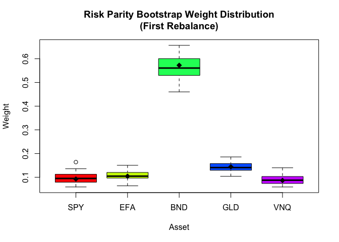
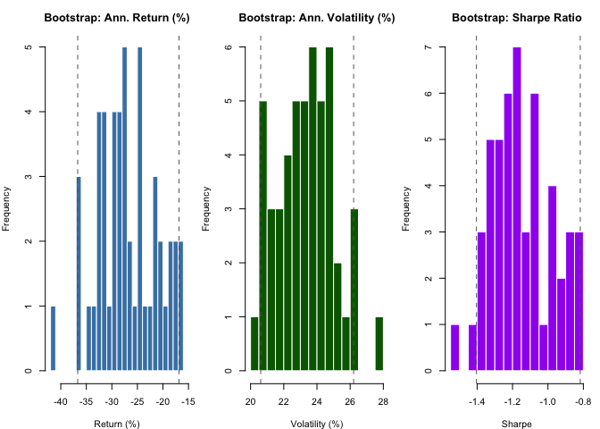
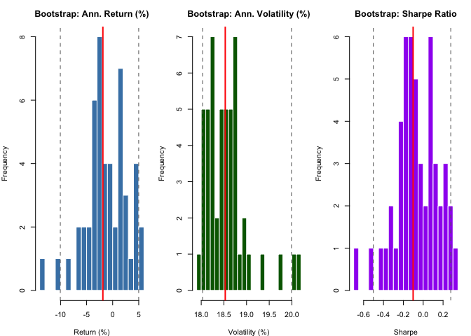
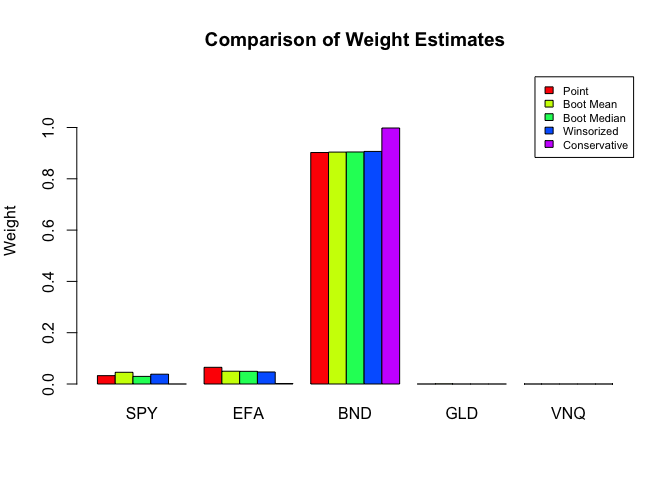

```
## Loading required package: xts
```

```
## Loading required package: zoo
```

```
## 
## Attaching package: 'zoo'
```

```
## The following objects are masked from 'package:base':
## 
##     as.Date, as.Date.numeric
```

```
## Loading required package: TTR
```

```
## Registered S3 method overwritten by 'quantmod':
##   method            from
##   as.zoo.data.frame zoo
```

```
## =======================================================================
```

```
## ADVANCED PORTFOLIO OPTIMIZATION WITH BOOTSTRAP
```

```
## =======================================================================
```

```
## 
## Downloading data for: SPY, EFA, BND, GLD, VNQ
```

```
## 
## Data summary:
```

```
##   Period: 2018-01-03 to 2026-01-08
```

```
##   Observations: 2015
```

```
##   Assets: SPY, EFA, BND, GLD, VNQ
```

```
## -----------------------------------------------------------------------
```

```
## IN-SAMPLE STATISTICS
```

```
## -----------------------------------------------------------------------
```

```
## 
## Annualized statistics:
```

```
##              SPY   EFA  BND   GLD   VNQ
## Return (%) 13.34  7.08 1.77 14.89  4.80
## Vol (%)    19.48 18.04 5.97 15.17 22.42
## Sharpe      0.68  0.39 0.30  0.98  0.21
```

```
## 
## Correlation matrix:
```

```
##      SPY  EFA  BND  GLD  VNQ
## SPY 1.00 0.86 0.15 0.10 0.75
## EFA 0.86 1.00 0.20 0.22 0.70
## BND 0.15 0.20 1.00 0.32 0.29
## GLD 0.10 0.22 0.32 1.00 0.15
## VNQ 0.75 0.70 0.29 0.15 1.00
```

```
## =======================================================================
```

```
## OUT-OF-SAMPLE BACKTEST
```

```
## =======================================================================
```

```
## 
## Backtest setup:
```

```
##   Training window: 504 days (~2 years)
```

```
##   Rebalance frequency: 63 days (~quarterly)
```

```
##   Number of rebalances: 23
```

```
##   Bootstrap replicates per rebalance: 50
```


```
## 
## Running backtest...
```


```
## 
## Backtest completed!
```


```
## -----------------------------------------------------------------------
```

```
## BACKTEST RESULTS
```

```
## -----------------------------------------------------------------------
```

```
## 
## Out-of-sample performance:
```

```
##                 Ann.Return(%) Ann.Vol(%) Sharpe MaxDD(%)
## Equal Weight            8.811     13.557  0.650  -25.572
## Min Variance            1.639      6.795  0.241  -18.538
## Max Sharpe              7.705     14.107  0.546  -28.729
## Risk Parity             7.067      9.389  0.753  -18.448
## Black-Litterman         3.135      7.088  0.442  -17.882
## Shrinkage               1.649      6.799  0.243  -18.540
```

```
## 
## Best Sharpe ratio: Risk Parity = 0.753
```


```
## -----------------------------------------------------------------------
```

```
## BOOTSTRAP WEIGHT UNCERTAINTY (First 3 Rebalances)
```

```
## -----------------------------------------------------------------------
```

```
## [1] 1
## 
## Rebalance 1 (Date: 2020-01-06 ):
##   Point estimate:
## [1] 0.0325 0.0651 0.9024 0.0000 0.0000
##   Bootstrap mean:
##    SPY    EFA    BND    GLD    VNQ 
## 0.0456 0.0498 0.9041 0.0004 0.0000 
##   Bootstrap SE:
##    SPY    EFA    BND    GLD    VNQ 
## 0.0522 0.0429 0.0344 0.0020 0.0000 
##   95% CI:
##     SPY: [0.000, 0.167]
##     EFA: [0.000, 0.126]
##     BND: [0.818, 0.956]
##     GLD: [0.000, 0.005]
##     VNQ: [0.000, 0.000]
## [1] 2
## 
## Rebalance 2 (Date: 2020-04-06 ):
##   Point estimate:
## [1] 0.0448 0.0000 0.8516 0.1037 0.0000
##   Bootstrap mean:
##    SPY    EFA    BND    GLD    VNQ 
## 0.0442 0.0156 0.8306 0.1097 0.0000 
##   Bootstrap SE:
##    SPY    EFA    BND    GLD    VNQ 
## 0.0338 0.0301 0.0999 0.1364 0.0000 
##   95% CI:
##     SPY: [0.000, 0.100]
##     EFA: [0.000, 0.085]
##     BND: [0.610, 0.921]
##     GLD: [0.000, 0.390]
##     VNQ: [0.000, 0.000]
## [1] 3
## 
## Rebalance 3 (Date: 2020-07-07 ):
##   Point estimate:
## [1] 0.0357 0.0000 0.8802 0.0841 0.0000
##   Bootstrap mean:
##    SPY    EFA    BND    GLD    VNQ 
## 0.0451 0.0119 0.8648 0.0782 0.0000 
##   Bootstrap SE:
##    SPY    EFA    BND    GLD    VNQ 
## 0.0303 0.0217 0.1051 0.1324 0.0000 
##   95% CI:
##     SPY: [0.000, 0.093]
##     EFA: [0.000, 0.063]
##     BND: [0.585, 0.943]
##     GLD: [0.000, 0.415]
##     VNQ: [0.000, 0.000]
```


<!-- -->


<!-- -->


<!-- -->


<!-- -->


```
## =======================================================================
```

```
## STRATEGY COMPARISON SUMMARY
```

```
## =======================================================================
```

```
## 
## Strategy rankings (1 = best):
```

```
##         Strategy Return_Rank Vol_Rank Sharpe_Rank MaxDD_Rank Avg_Rank
##      Risk Parity           3        4           1          2     2.50
##  Black-Litterman           4        3           4          1     3.00
##     Equal Weight           1        5           2          5     3.25
##     Min Variance           6        1           6          3     4.00
##        Shrinkage           5        2           5          4     4.00
##       Max Sharpe           2        6           3          6     4.25
```

```
## -----------------------------------------------------------------------
```

```
## KEY FINDINGS
```

```
## -----------------------------------------------------------------------
```

```
## 1. PERFORMANCE: Best overall strategy is Risk Parity
```

```
##    - Highest Sharpe: Risk Parity
```

```
##    - Lowest volatility: Min Variance
```

```
##    - Smallest drawdown: Black-Litterman
```

```
## 2. UNCERTAINTY: Bootstrap analysis reveals substantial weight uncertainty
```

```
##    - 95% CIs often span 20-40 percentage points
```

```
##    - Optimal weights are estimates, not certainties
```

```
## 3. ROBUSTNESS: Strategies with regularization (Shrinkage, Risk Parity)
```

```
##    often outperform unconstrained optimization out-of-sample
```

```
## 4. IMPLICATIONS:
```

```
##    - Use bootstrap CIs to assess allocation confidence
```

```
##    - Consider robust/regularized methods over naive optimization
```

```
##    - Report uncertainty alongside point estimates
```

```
##    - Rebalancing frequency affects results significantly
```

```
## =======================================================================
```

```
## BOOTSTRAP VS POINT ESTIMATE COMPARISON
```

```
## =======================================================================
```

```
## 
## First Rebalance - Weight Comparison:
##  Asset Point_Est Boot_Mean Difference Boot_SE CI_Lower CI_Upper
##    SPY    0.0325    0.0456     0.0131  0.0522    0.000   0.1672
##    EFA    0.0651    0.0498    -0.0153  0.0429    0.000   0.1264
##    BND    0.9024    0.9041     0.0017  0.0344    0.818   0.9558
##    GLD    0.0000    0.0004     0.0004  0.0020    0.000   0.0048
##    VNQ    0.0000    0.0000     0.0000  0.0000    0.000   0.0000
## 
## Probability of being largest allocation:
##   SPY: 0.0%
##   EFA: 0.0%
##   BND: 100.0%
##   GLD: 0.0%
##   VNQ: 0.0%
## 
## Weight stability (coefficient of variation):
##   SPY: CV=1.14 (Unstable)
##   EFA: CV=0.86 (Unstable)
##   BND: CV=0.04 (Stable)
##   GLD: CV=4.53 (Unstable)
##   VNQ: CV=0.00 (Stable)
```


```
## -----------------------------------------------------------------------
```

```
## PORTFOLIO PERFORMANCE UNCERTAINTY
```

```
## -----------------------------------------------------------------------
```

```
## 
## Expected portfolio performance (first holding period):
## 
## Point estimate:
##   Ann. Return: -1.88%
##   Ann. Vol: 18.53%
##   Sharpe: -0.101
## 
## Bootstrap distribution:
##   Ann_Return: Median=-1.44, 95% CI=[-10.04, 4.99]
##   Ann_Vol: Median=18.50, 95% CI=[18.03, 19.99]
##   Sharpe: Median=-0.08, 95% CI=[-0.50, 0.28]
```

<!-- -->


```
## =======================================================================
```

```
## ROBUST WEIGHT RECOMMENDATIONS
```

```
## =======================================================================
```

```
## 
## Alternative weight estimates:
##  Asset Point Boot_Mean Boot_Median Winsorized Conservative
##    SPY 0.033     0.046       0.030      0.038        0.000
##    EFA 0.065     0.050       0.049      0.047        0.002
##    BND 0.902     0.904       0.905      0.907        0.998
##    GLD 0.000     0.000       0.000      0.000        0.000
##    VNQ 0.000     0.000       0.000      0.000        0.000
## 
## Recommendation:
##   - For maximum expected return: Use Point Estimate or Boot Mean
##   - For robustness: Use Boot Median or Winsorized Mean
##   - For risk-averse investors: Use Conservative (25th percentile)
```

<!-- -->

```
## -----------------------------------------------------------------------
```

```
## TURNOVER ANALYSIS
```

```
## -----------------------------------------------------------------------
```

```
## 
## Average turnover per rebalance (sum of |Δw|):
```

```
##         Strategy Avg_Turnover Turnover_Pct
##     Equal Weight       0.0000           0%
##     Min Variance       0.0610         6.1%
##       Max Sharpe       0.5150        51.5%
##      Risk Parity       0.0559         5.6%
##  Black-Litterman       0.0745         7.4%
##        Shrinkage       0.0614         6.1%
```

```
## 
## Sharpe ratio adjusted for transaction costs (assuming 10bps per turnover):
```


```
##                         Strategy Raw_Sharpe TC_Adj_Sharpe Difference
##        Equal Weight.Equal Weight      0.650         0.650      0.000
##        Min Variance.Min Variance      0.241         0.238     -0.004
##            Max Sharpe.Max Sharpe      0.546         0.532     -0.015
##          Risk Parity.Risk Parity      0.753         0.750     -0.002
##  Black-Litterman.Black-Litterman      0.442         0.438     -0.004
##              Shrinkage.Shrinkage      0.243         0.239     -0.004
```


```
## =======================================================================
```

```
## DEMO COMPLETE
```

```
## =======================================================================
```

```
## This demo demonstrated:
```

```
##   1. Six portfolio optimization strategies:
```

```
##      - Equal Weight (benchmark)
```

```
##      - Minimum Variance
```

```
##      - Maximum Sharpe Ratio
```

```
##      - Risk Parity
```

```
##      - Black-Litterman
```

```
##      - Shrinkage (Ledoit-Wolf)
```

```
##   2. Real market data (SPY, EFA, BND, GLD, VNQ)
```

```
##   3. Out-of-sample backtesting with quarterly rebalancing
```

```
##   4. Bootstrap uncertainty quantification for optimal weights
```

```
##   5. DCC-GARCH modeling for time-varying correlations
```

```
##   6. Robust weight estimation methods
```

```
##   7. Turnover and transaction cost analysis
```

```
## The MS-VARMA-GARCH bootstrap provides:
```

```
##   - Realistic uncertainty estimates for portfolio weights
```

```
##   - Proper handling of volatility clustering
```

```
##   - Dynamic correlation structure preservation
```

```
##   - Regime-switching capability for changing market conditions
```

```
## Key takeaways:
```

```
##   - Optimal weights have substantial estimation uncertainty
```

```
##   - Bootstrap CIs help set realistic expectations
```

```
##   - Regularized methods (Risk Parity, Shrinkage) often perform well OOS
```

```
##   - Transaction costs matter - consider turnover when selecting strategies
```

```
##   - Report uncertainty alongside point estimates for transparency
```

